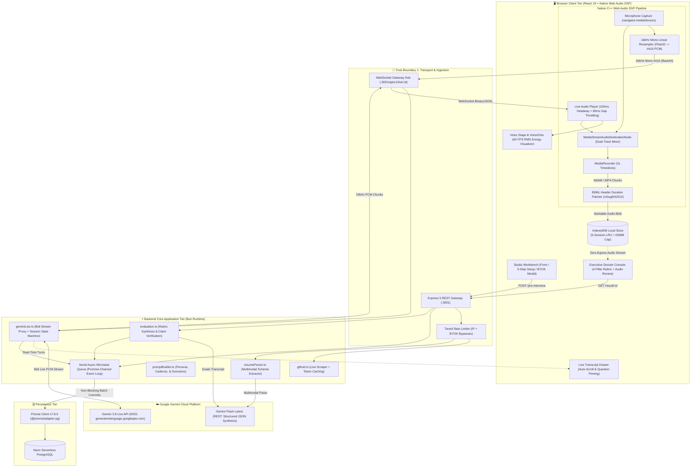
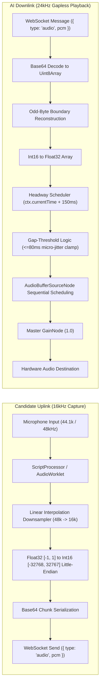
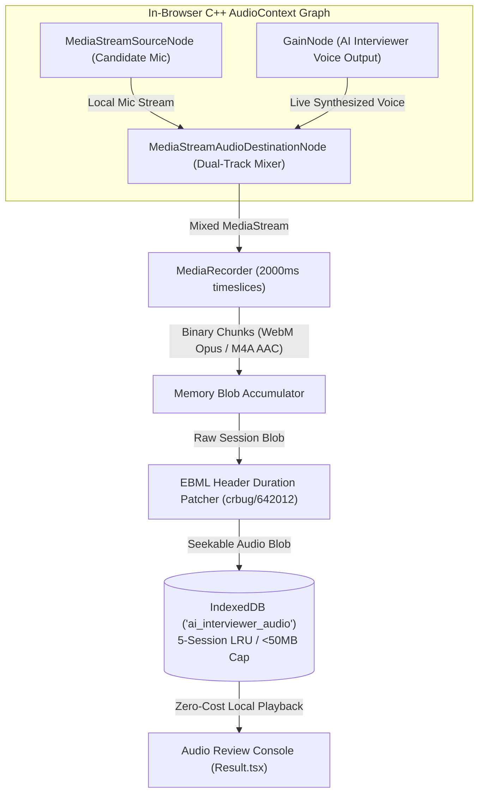
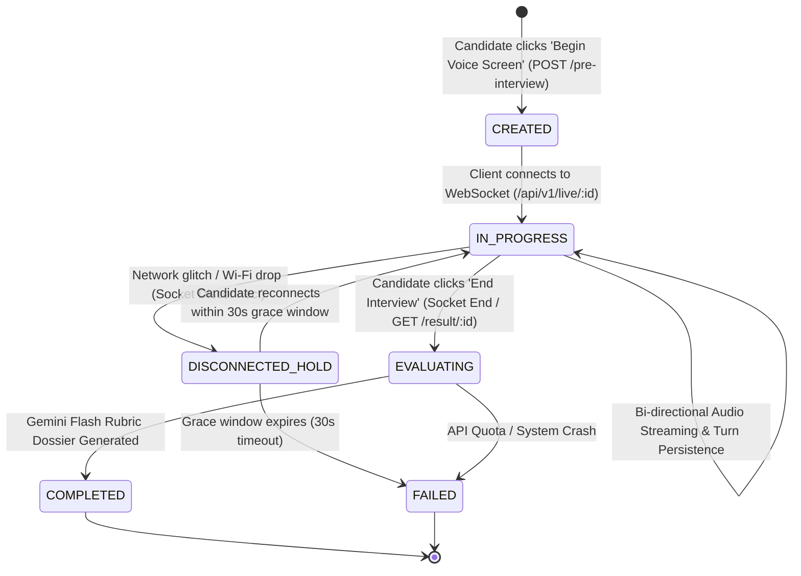
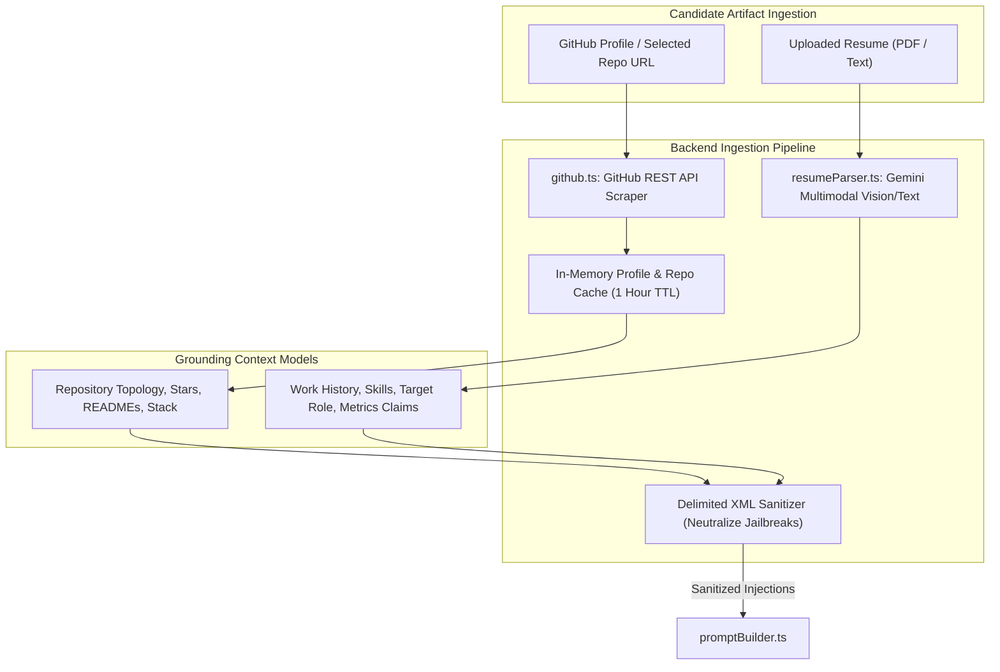
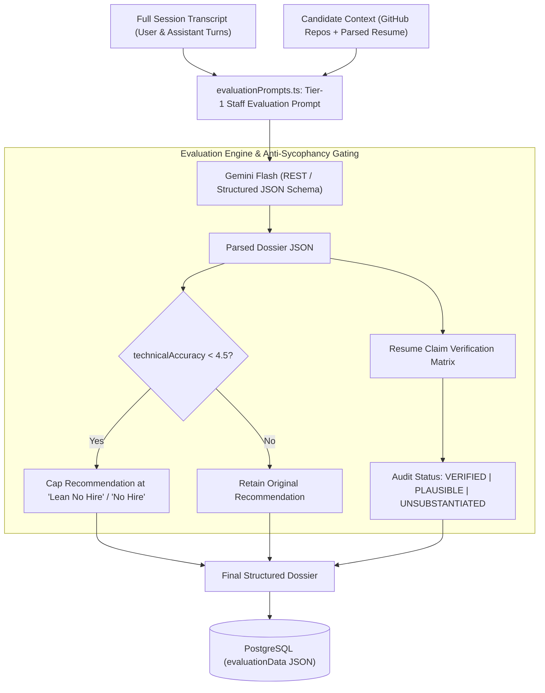
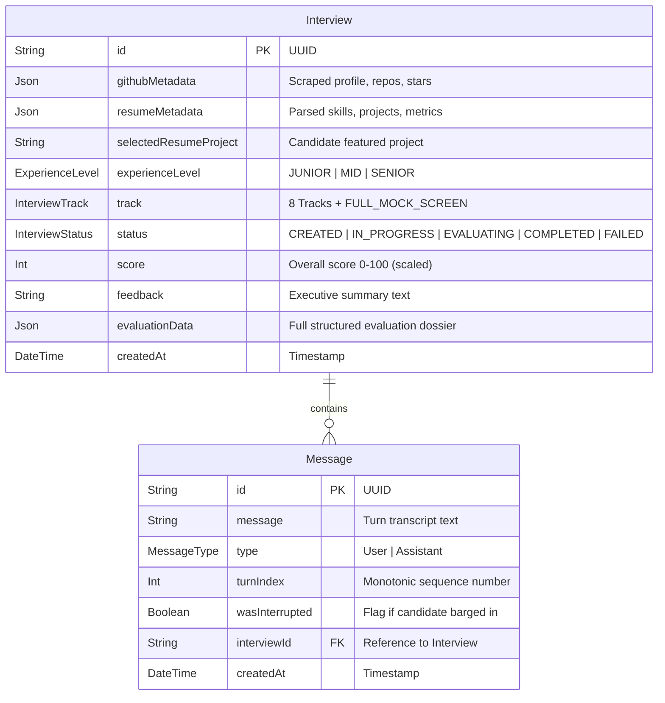
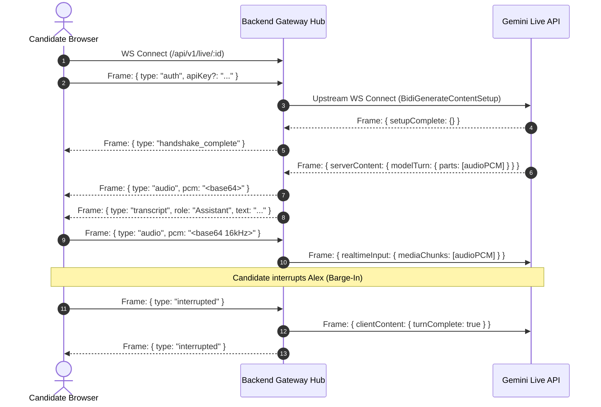
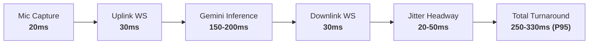
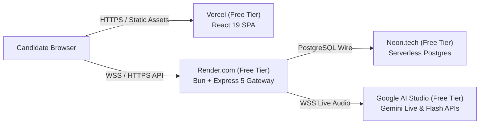

# AI Technical Interviewer — System Design Document (SDD)

> **Document Status**: `ACCEPTED / PRODUCTION SPECIFICATION`  
> **Document Version**: `1.0.0`  
> **Classification**: Core Engineering Design & Technical Specification  
> **Authors**: Antigravity & AI Interviewer Core Architecture Team  
> **Target Audience**: Staff/Principal Engineers, Systems Architects, Engineering Reviewers  
> **Canonical Path**: [`docs/DESIGN_DOC.md`](file:///Users/chirag/Documents/opensource-projects/ai-interviewer/docs/DESIGN_DOC.md)  
> **Last Updated**: September 2026

---

## 1. Executive Summary & Abstract

**AI Technical Interviewer** is an open-source, full-duplex, multimodal voice platform that conducts autonomous, production-calibrated technical screening interviews. Unlike legacy conversational chatbots or cascaded multi-hop voice agents ($\text{STT} \to \text{LLM} \to \text{TTS}$) with $1.5\text{--}3.0\text{s}$ turn-around latencies, AI Technical Interviewer achieves sub-350ms end-to-end voice latency by streaming raw PCM audio directly into Google's **Gemini Multimodal Live API** (`gemini-3.8-live` / `gemini-3.1-flash-live-preview`).

The system eliminates canned trivia by dynamically grounding interview questions in real artifacts: the candidate's GitHub repositories, verified code contributions, and parsed resume claims. Operating as a calibrated Staff Engineer persona ("Alex"), the system enforces strict turn cadence ($<20\%$ interviewer speech share), a 3-layer depth model (Architecture $\to$ Internals $\to$ Production Pressures), and active metric-pressure probing. Following the session, an automated evaluation pipeline synthesizes a 4-pillar engineering dossier with anti-sycophancy gating and an authenticity audit matrix.

Crucially, the entire client-server architecture runs within a **100% Free-Tier Cost Profile**: it requires **\$0 in cloud egress/storage** by executing real-time dual-track audio recording directly inside the browser's native C++ Web Audio DSP graph, repairing browser container bugs in-memory, and caching sessions in IndexedDB.

---

## 2. Problem Statement & Motivation

### 2.1 The Crisis in Engineering Screening

Technical hiring pipelines suffer from severe structural inefficiencies:

1. **Interviewer Fatigue & High Operational Cost**: Senior/Staff engineers spend $15\text{--}25\%$ of their working hours conducting preliminary technical screens. This creates massive operational expense ($>\$200$ per candidate screen in engineering time) while degrading interviewer consistency.
2. **Artificial & Leaked Trivia**: Standard screening relies on LeetCode-style puzzles or canned behavioral scripts readily memorized by candidates or solved via hidden LLM overlays, failing to measure real-world production judgment.
3. **Sycophancy & Charisma Bias in AI Grading**: Naive LLM evaluators are susceptible to conversational agreeableness, assigning passing scores to confident, charismatic candidates despite severe technical inaccuracies.
4. **Resumé Inflation & Authorship Dilution**: Resumes routinely claim massive architectural accomplishments ($"Reduced latency by 80%"$, $"Architected distributed Kafka pipeline"$) that candidates cannot defend under mechanical cross-examination.

### 2.2 The Latency Wall in Traditional Voice AI

Legacy voice bots rely on a cascaded 3-hop pipeline:
$$\text{Microphone} \xrightarrow{\text{WebRTC}} \text{STT (Deepgram/Whisper)} \xrightarrow{800\text{ms}} \text{LLM (Claude/GPT)} \xrightarrow{600\text{ms}} \text{TTS (ElevenLabs/Cartesia)} \xrightarrow{400\text{ms}} \text{Speaker}$$
This results in total turnaround times of **$1800\text{--}3000\text{ms}$**, completely destroying natural human conversational rhythm, making spontaneous candidate barge-in interruptions unnatural, and inducing awkward mutual speech pauses.

### 2.3 Proposed Solution

AI Technical Interviewer establishes a unified streaming architecture combining:

- **Direct Bi-Directional Native Voice-to-Voice Streaming** over WebSockets with $<350\text{ms}$ P95 turnaround.
- **Dynamic Context Ingestion** linking candidate GitHub repos and parsed multimodal resumes.
- **Calibrated Conversational Invariants** governing conversational turn cadence, question discipline, and depth drilling.
- **Zero-Cost Client-Side Audio DSP Architecture** eliminating cloud audio storage fees.
- **Anti-Sycophancy Structured Grading Dossier** with verifiable evidence quotes and claim authenticity audits.

---

## 3. Goals & Explicit Non-Goals

### 3.1 Design Goals

- **G1: Sub-350ms Conversational Voice Turnaround**: End-to-end voice latency from speech cessation to audio response playback must remain under $350\text{ms}$ (P95) and $250\text{ms}$ (P50).
- **G2: Real-Time Barge-In Interruption with $<50\text{ms}$ Cancellation**: When candidate begins speaking while Alex is talking, audio output must immediately halt, buffers must flush, and upstream generation must cancel within $50\text{ms}$.
- **G3: Strict Invariant Enforcement (2-Sentence Cadence & Airtime Governance)**: Interviewer responses must strictly obey the 2-sentence formula (Sentence 1: Micro-grounding $\le 8$ words; Sentence 2: Probing question) and occupy $<20\%$ total session airtime.
- **G4: Artifact-Grounded Probing & Claim Auditing**: Every interview scenario must anchor to the candidate's chosen track, actual GitHub code, and parsed resume claims, actively probing claimed percentages and single-author commits.
- **G5: Zero-Cost Session Recording**: Full dual-track audio recording of candidate mic and AI voice must be synthesized, seekable, and downloadable without incurring cloud storage, processing, or egress fees.
- **G6: Bring-Your-Own-Key (BYOK) Security**: Candidates and interviewers can supply their own Google Gemini API keys stored strictly in client `localStorage`, with zero server-side persistence or database logging.
- **G7: Anti-Sycophancy Scorecard Gating**: Scoring logic must enforce deterministic competency caps (`technicalAccuracy < 4.5` strictly caps hiring recommendation at `Lean No Hire`).

### 3.2 Non-Goals

- **NG1: Replacing On-Site Final Consensus**: The system is designed for automated first-round screening and candidate self-practice; it does not replace multi-stakeholder final hiring committees.
- **NG2: Invasive Video/Facial Sentiment Proctoring**: The platform intentionally avoids webcam facial analysis, eye-tracking, or predatory proctoring spyware to maintain candidate dignity and privacy.
- **NG3: Arbitrary Remote Code Execution (RCE)**: Real-time audio screening focuses on architectural reasoning, systems intuition, and production triage rather than managing an in-browser Linux Docker container.
- **NG4: Multi-Interviewer Panel Simulation**: The system focuses exclusively on single-interviewer 1:1 dialogic depth rather than simulating multi-party conversational panel dynamics.

---

## 4. High-Level Architecture (HLD) & System Topology

The platform comprises five primary tiers operating across four explicit trust boundaries:



### 4.1 System Trust Boundaries & Isolation

1. **Trust Boundary 1 (Client $\leftrightarrow$ Gateway)**: All inbound HTTP and WebSocket requests pass through Helmet HTTP security headers, CORS verification, and tiered rate limiters (`express-rate-limit`). BYOK keys submitted via `x-gemini-api-key` headers or WebSocket initialization payloads are stripped from all diagnostic logs.
2. **Trust Boundary 2 (Untrusted Candidate Content $\leftrightarrow$ Prompt Engine)**: Candidate-supplied GitHub READMEs, commit histories, and parsed resume texts represent untrusted third-party inputs. They are sanitized and isolated within hard XML boundaries (`<untrusted_candidate_resume_context>`, `<candidate_codebase_context>`) to neutralize prompt injection and jailbreak payloads.
3. **Trust Boundary 3 (Application Gateway $\leftrightarrow$ Gemini Live Cloud)**: Upstream WebSocket connections to `generativelanguage.googleapis.com` are proxied by the backend gateway, insulating the client from upstream network disconnects and authenticating with either hosted or client-supplied API credentials.
4. **Trust Boundary 4 (Audio Data $\leftrightarrow$ Cloud Egress)**: Candidate microphone audio and synthesized AI interviewer speech are **never uploaded to cloud storage**. Audio mixing and persistence remain $100\%$ client-side in the browser's IndexedDB, enforcing strict candidate privacy and zero storage costs.

---

## 5. Detailed Component Low-Level Design (LLD)

### 5.1 Real-Time Multimodal Voice & Audio DSP Subsystem

The client audio subsystem ([`audioProcessor.ts`](file:///Users/chirag/Documents/opensource-projects/ai-interviewer/apps/frontend/src/lib/audioProcessor.ts)) manages bidirectional low-latency audio capture and playback with native Web Audio API nodes.



#### 5.1.1 Microphone Capture & Linear Resampling

Candidate audio is acquired via `navigator.mediaDevices.getUserMedia({ audio: { channelCount: 1, sampleRate: 16000, echoCancellation: true, noiseSuppression: true, autoGainControl: true } })`. Because hardware sample rates frequently default to $44.1\text{kHz}$ or $48\text{kHz}$ regardless of constraints, client-side downsampling is mandatory.

The linear downsampler computes output samples $y[m]$ at time index $m$ given input buffer $x[n]$:
$$\text{ratio} = \frac{f_{\text{in}}}{f_{\text{out}}} = \frac{f_{\text{in}}}{16000}$$
$$\text{position} = m \cdot \text{ratio}, \quad \text{index} = \lfloor\text{position}\rfloor, \quad \alpha = \text{position} - \text{index}$$
$$y[m] = (1 - \alpha) \cdot x[\text{index}] + \alpha \cdot x[\text{index} + 1]$$

Float32 samples in the normalized range $[-1.0, 1.0]$ are quantized to 16-bit signed integers:
$$\text{sample}_{\text{int16}} = \max(-32768, \min(32767, \lfloor\text{sample}_{\text{float}} \cdot 32767\rfloor))$$
Bytes are packed into an `ArrayBuffer` in Little-Endian byte order and transmitted as Base64 JSON payloads over the WebSocket.

#### 5.1.2 24kHz Jitter-Free Playback & Sequential Gap Thresholding

Gemini Live transmits AI speech as base64-encoded $24\text{kHz}$ mono 16-bit PCM chunks. In `LiveAudioPlayer`:

1. **Odd-Byte Boundary Assembly**: Network packet fragmentation can split 16-bit sample words across chunk boundaries. A single `remainderByte` buffer caches unmatched odd bytes between frames, prepending them to the subsequent packet.
2. **150ms Headway Jitter Buffer**: To prevent underrun pops from network arrival variance, playback of an initial turn begins with a fixed headway:
   $$t_{\text{start}} = \max(\text{nextPlayTime}, \text{ctx.currentTime} + 0.150)$$
3. **80ms Gap Thresholding**: JavaScript event-loop micro-jitter can introduce small $10\text{--}40\text{ms}$ gaps between packet arrivals. The scheduler compares delta $\Delta = \text{ctx.currentTime} - \text{nextPlayTime}$:
   - If $\Delta \le 80\text{ms}$, it treats the gap as network jitter and chains playback seamlessly to $\text{nextPlayTime}$, eliminating audible stutter.
   - If $\Delta > 80\text{ms}$, it treats the gap as an intentional conversational pause or new turn, resetting $\text{nextPlayTime}$ with fresh headroom.
4. **Barge-In Interruption**: When microphone RMS energy exceeds candidate speech thresholds while AI is speaking, the client triggers `player.stop()`:
   - All active `AudioBufferSourceNode` instances are immediately stopped and disconnected.
   - The scheduled playback queue is cleared and `nextPlayTime` is reset to 0.
   - An interrupt notification is transmitted upstream over WebSocket.

---

### 5.2 Zero-Cost Dual-Track Client Audio Recording Subsystem

Traditional SaaS voice platforms incur substantial recurring infrastructure costs by recording and transcoding audio server-side (uploading raw streams to AWS S3 / GCP Cloud Storage at $\$0.05\text{--}\$0.20$ per hour). AI Technical Interviewer completely eliminates this cost vector through an in-browser Web Audio DSP graph ([`webmDurationPatcher.ts`](file:///Users/chirag/Documents/opensource-projects/ai-interviewer/apps/frontend/src/lib/webmDurationPatcher.ts), [`audioStorage.ts`](file:///Users/chirag/Documents/opensource-projects/ai-interviewer/apps/frontend/src/lib/audioStorage.ts)).



#### 5.2.1 Native Graph Mixing

A dedicated `MediaStreamAudioDestinationNode` captures audio directly from the browser's internal audio routing engine:

- `candidateMicSource.connect(mixerDestination)`
- `aiMasterGain.connect(mixerDestination)`
  Mixing occurs inside the browser's multi-threaded native C++ audio thread with zero JavaScript garbage collection or CPU overhead.

#### 5.2.2 The Chromium WebM Duration Bug (`crbug/642012`) Fix

Chromium's `MediaRecorder` generates WebM files without duration metadata when streaming continuously. As a result, native `<audio>` players render the file as a "Live Broadcast" with `Infinity` duration, preventing scrubbing, seeking, and timestamp alignment.

The subsystem patches this in-memory:

1. It parses the binary EBML (Extensible Binary Meta Language) container structure.
2. It locates the `Segment` (ID `0x18538067`) and `Info` (ID `0x1549A966`) master elements.
3. It writes a precise `Duration` element (ID `0x4489`) formatted as an IEEE 754 float in Segment Timecode units ($1\text{ms}$ ticks), ensuring full seekability across all standard media players.

#### 5.2.3 Client-Side Storage Architecture

- **Engine**: Browser `IndexedDB` database (`ai_interviewer_audio`, object store: `recordings`).
- **LRU Eviction**: Retains a rolling window of the last 5 sessions, capping storage usage at $<50\text{MB}$.
- **Export**: Generates standard RFC-compliant Object URLs for local `.webm` / `.m4a` file downloads with candidate-specific filenames (`interview-<id>.webm`).

---

### 5.3 Application Gateway & WebSocket Hub

The backend gateway ([`geminiLive.ts`](file:///Users/chirag/Documents/opensource-projects/ai-interviewer/apps/backend/services/geminiLive.ts), [`interview.ts`](file:///Users/chirag/Documents/opensource-projects/ai-interviewer/apps/backend/routes/interview.ts)) handles authentication, rate limiting, and real-time bidirectional streaming.

#### 5.3.1 Session Lifecycle State Machine

Interview sessions transition through five formal states:



#### 5.3.2 30-Second Reconnection Grace Period

If candidate network connectivity drops momentarily (e.g. mobile handoff, Wi-Fi blip):

1. The backend preserves the upstream Gemini Live WebSocket session in an in-memory `activeSessions` map.
2. A 30-second grace timer is initiated.
3. If the candidate reconnects within 30 seconds with the same `interviewId`, the server cancels the timer, attaches the new client socket to the existing session, and dispatches a `{ type: "reconnected" }` frame.
4. If the timer expires, the upstream session is cleanly terminated and the interview is transitioned.

#### 5.3.3 Asynchronous Non-Blocking Database Write Queue

To prevent database I/O from introducing event-loop lag into the real-time audio forwarding thread, turn messages are written asynchronously through a chained promise queue:

```typescript
dbWriteQueue = dbWriteQueue.then(async () => {
  await prisma.message.create({
    data: { interviewId, type, message: text, turnIndex, wasInterrupted },
  });
});
```

This guarantees strict in-order persistence without blocking WebSocket packet dispatch.

---

### 5.4 Context Ingestion & Grounding Subsystem



#### 5.4.1 Real-Time GitHub Ingestion (`github.ts`)

- Queries GitHub REST API v3 to fetch candidate profile data, star counts, fork counts, and public repositories.
- Ranks repositories using a composite heuristic:
  $$\text{Score} = (\text{stars} \times 3) + (\text{forks} \times 2) + (\text{recency\_weight})$$
- Fetches and strips raw Markdown from repository `README.md` files, extracting architectural dependencies (`package.json`, `go.mod`, `Cargo.toml`, `requirements.txt`).
- Implements an in-memory cache with a 1-hour TTL to prevent hitting GitHub's unauthenticated IP rate limits (60 requests/hour).

#### 5.4.2 Multimodal Resume Parsing Engine (`resumeParser.ts`)

- Accepts PDF documents (base64-encoded) or raw pasted text.
- Leverages Gemini Multimodal processing with structured JSON schema output to parse:
  - `targetRole` and `yearsOfExperience`.
  - `skills`: Categorized into languages, frameworks, databases, and cloud tools.
  - `projects`: Extracted with explicit tech stack lists and **claimed quantitative metrics** (e.g. _"reduced P99 latency from 450ms to 85ms"_).
  - `workHistory`: Company, title, duration, and key bullet points.
- Extracts an explicit list of `High-Priority Quantifiable Claims to Audit` to be passed into the interviewer prompt.

---

### 5.5 Conversational Persona & Cadence Engine (`promptBuilder.ts`)

The AI Interviewer persona, **Alex**, is calibrated to emulate a Staff Engineer conducting a rigorous, professional technical screen.

#### 5.5.1 The 2-Sentence Turn Formula & Airtime Governance

To prevent AI monologues and packet collision, Alex is strictly constrained by a deterministic response formula:

- **Sentence 1 (Micro-Grounding $\le 8$ words)**: Acknowledge the candidate's last point without generic flattery (_"Understood, so write contention is high."_).
- **Sentence 2 (Probing Question)**: A single, targeted technical question probing mechanics, trade-offs, or failure boundaries (_"How do you prevent deadlocks when updating parent-child records concurrently?"_).
- **Airtime Cap**: Alex's speech occupies $<20\%$ of total session duration, leaving $>80\%$ of airtime for the candidate.

#### 5.5.2 The 3-Layer Depth Drill

For every topic, Alex executes an adaptive 3-layer drill before transitioning:

1. **Layer 1: Architectural Decision**: Why did you choose this component or architecture over standard alternatives?
2. **Layer 2: Under-the-Hood Mechanics**: How does the underlying technology work internally (B-Trees, Write-Ahead Logs, V8 event loop microtasks, TCP window sizing)?
3. **Layer 3: Production Pressures**: What happens when load increases $10\times$, network partitions occur, or downstream services degrade?

#### 5.5.3 Dynamic Track & Seniority Matrix

The system supports 8 dedicated tracks plus the flagship **360° Full Mock Screen**:

- **Tracks**: Full-Stack, Backend, Frontend, System Design, DSA, Behavioral, DevOps & Cloud, ML/AI.
- **27 Seeded Production Scenarios**: Concrete real-world systems archetypes (e.g., distributed rate limiting, zero-downtime database schema migration, multi-tenant Kafka partitioning, idempotent payment processing).
- **Seniority Adaptation**:
  - **Junior**: Encouraging, collaborative scaffolding, conceptual definitions, graceful recovery from naive traps.
  - **Mid-Level**: Focus on API mechanics, trade-offs, standard concurrency pitfalls, and operational monitoring.
  - **Senior / Staff**: Adversarial stress-testing, anti-hand-waving invariants, deep distributed systems failure modes, and architectural ownership defense.

#### 5.5.4 Live Metric-Pressure & Authorship Probing Protocol

When candidate resumes or repos contain impressive metrics:

- Alex directly challenges the claim: _"You noted an 80% reduction in database latency—what was the specific baseline query plan, and which indexing strategy produced that delta?"_
- If candidate falters, Alex isolates whether the work was self-authored or inherited from a broader team, measuring authentic individual ownership.

---

### 5.6 Post-Interview Evaluation & Scoring Dossier Engine (`evaluation.ts`)

Post-interview evaluation transforms raw conversation transcripts into an **Executive Engineering Dossier** graded by `gemini-flash-latest` using structured schema outputs.



#### 5.6.1 4-Pillar Engineering Competency Rubric

Candidates are evaluated on a 0–10 scale across four distinct pillars:

1. **Technical Accuracy**: Correctness of CS fundamentals, framework semantics, data structures, and protocol mechanics.
2. **Problem Solving**: Algorithmic reasoning, edge-case identification, decomposition of ambiguous scenarios.
3. **Communication & Cadence**: Clarity, structured thinking (top-down explanations), brevity, collaborative tone.
4. **Systems Depth**: Understanding of lower-level primitives (memory allocation, networking, cache invalidation, consensus).

#### 5.6.2 Deterministic Anti-Sycophancy Gating

To prevent conversational agreeableness from corrupting hiring decisions, the evaluation engine enforces hard architectural invariants:

- If $\text{score}(\text{technicalAccuracy}) < 4.5$, the recommendation is **strictly capped at `Lean No Hire`**, regardless of stellar communication or high overall confidence.
- **Anti-Spoonfeeding Invariant**: If Alex supplied a key architectural insight or answered a question for the candidate, that turn earns **zero depth credit**.

#### 5.6.3 Resume Claim Verification Matrix

Every key quantitative claim extracted from the candidate's resume is cross-referenced with the live transcript, assigning one of three explicit audit verdicts:

- **`VERIFIED`**: Candidate defended the metric with deep mechanical specifics (query plans, flame graphs, configuration changes).
- **`PLAUSIBLE`**: Candidate described reasonable concepts but lacked granular execution metrics.
- **`UNSUBSTANTIATED`**: Candidate dodged the question, contradicted their resume, or failed to explain basic architectural mechanics of the claimed project.

---

## 6. Data Architecture & Persistence Tier

### 6.1 Relational Database Schema (PostgreSQL + Prisma)

The persistence model is defined in [`schema.prisma`](file:///Users/chirag/Documents/opensource-projects/ai-interviewer/apps/backend/prisma/schema.prisma):



#### 6.1.1 Indexing & Query Optimization

- `Interview(status)`: Enables fast administrative filtering of active sessions.
- `Interview(createdAt)`: Optimizes paginated session retrieval.
- `Message(interviewId, turnIndex)`: Composite index ensuring $O(1)$ ordered transcript hydration during reconnects.
- `Message(interviewId, createdAt)`: Enables sequential timeline assembly.

### 6.2 Browser Local Storage & IndexedDB Schema

- **`localStorage`**: Stores BYOK credentials (`user_gemini_api_key`) and UI preferences.
- **`IndexedDB` (`ai_interviewer_audio`)**:
  - Store: `recordings`
  - Key: `interviewId` (String UUID)
  - Value: `{ id: string, blob: Blob, mimeType: string, durationSecs: number, createdAt: number }`

---

## 7. Protocol Specifications & API Contracts

### 7.1 HTTP REST Endpoint Specifications

#### `POST /api/v1/verify-key`

- **Purpose**: Rapid health check validating client-supplied Google Gemini API key.
- **Request**: `{ "apiKey": "AIzaSy..." }`
- **Response**: `{ "valid": true, "modelsCount": 42 }` or `{ "valid": false, "error": "Invalid API key" }`

#### `POST /api/v1/github-preview`

- **Purpose**: Rapid preview of candidate repositories for setup screen.
- **Request**: `{ "github": "torvalds" }`
- **Response**: `{ "profile": { "login": "torvalds", "avatarUrl": "..." }, "repos": [...] }`

#### `POST /api/v1/parse-resume`

- **Purpose**: Multimodal parsing of uploaded PDF resume.
- **Headers**: `x-gemini-api-key: <optional_byok_key>`
- **Request**: `{ "pdfBase64": "JVBERi0xLjQK..." }`
- **Response**: `{ "skills": [...], "projects": [...], "targetRole": "Backend Lead", "yearsOfExperience": 7 }`

#### `POST /api/v1/pre-interview`

- **Purpose**: Initialize interview session in database, scrape GitHub repo, attach resume.
- **Request**:
  ```json
  {
    "github": "octocat",
    "experienceLevel": "SENIOR",
    "track": "SYSTEM_DESIGN",
    "selectedRepo": "octocat/Spoon-Knife",
    "resumeMetadata": { ... },
    "selectedResumeProject": "High-Throughput Gateway"
  }
  ```
- **Response**: `{ "id": "9b1deb4d-3b7d-4bad-9bdd-2b0d7b3dcb6d" }`

#### `GET /api/v1/transcript/:id`

- **Purpose**: Reconnect hydration endpoint retrieving ordered turn transcript.
- **Response**:
  ```json
  {
    "interviewId": "9b1deb4d...",
    "messages": [
      {
        "id": "...",
        "type": "Assistant",
        "message": "Hi, let's begin.",
        "turnIndex": 1
      },
      {
        "id": "...",
        "type": "User",
        "message": "Sounds great.",
        "turnIndex": 2
      }
    ]
  }
  ```

#### `GET /api/v1/result/:id`

- **Purpose**: Fetch existing or compute on-demand candidate evaluation dossier.
- **Headers**: `x-gemini-api-key: <optional_byok_key>`
- **Response**:
  ```json
  {
    "score": 8,
    "feedback": "Strong candidate demonstrating deep understanding of distributed systems...",
    "evaluationData": {
      "overallScore": 8.2,
      "recommendation": "Hire",
      "summary": "...",
      "categories": { ... },
      "claimAudits": [ ... ],
      "evidence": [ ... ]
    }
  }
  ```

### 7.2 WebSocket Protocol Frames (`/api/v1/live/:id`)



| Frame Direction         | Type          | Payload Attributes                          | Purpose                                        |
| :---------------------- | :------------ | :------------------------------------------ | :--------------------------------------------- |
| **Client $\to$ Server** | `auth`        | `apiKey?: string`                           | Optional BYOK API key for session              |
| **Client $\to$ Server** | `audio`       | `pcm: string`                               | Base64 16kHz mono Int16 PCM chunk              |
| **Client $\to$ Server** | `end`         | none                                        | Explicit session termination by candidate      |
| **Client $\to$ Server** | `ping`        | none                                        | Keep-alive heartbeat frame                     |
| **Server $\to$ Client** | `audio`       | `pcm: string`                               | Base64 24kHz mono Int16 PCM chunk              |
| **Server $\to$ Client** | `transcript`  | `role: "User"\|"Assistant"`, `text: string` | Real-time speech transcription text            |
| **Server $\to$ Client** | `interrupted` | none                                        | Upstream confirmation of barge-in interruption |
| **Server $\to$ Client** | `reconnected` | `model: string`                             | Successful reattachment after Wi-Fi blip       |
| **Server $\to$ Client** | `error`       | `message: string`                           | Diagnostic error alert                         |

---

## 8. Latency Budget & Audio Math Specifications

### 8.1 End-to-End Latency Breakdown



| Pipeline Segment                            | Target P50         | Target P95         | Implementation Optimization                                                 |
| :------------------------------------------ | :----------------- | :----------------- | :-------------------------------------------------------------------------- |
| **Microphone Capture & Resampling**         | $15\text{ms}$      | $20\text{ms}$      | Linear downsampling directly on Float32 buffers; single-pass Int16 quantize |
| **WebSocket Uplink Transit**                | $20\text{ms}$      | $35\text{ms}$      | Direct binary/base64 chunks; zero server-side file buffering                |
| **Gemini Live Multimodal Inference**        | $140\text{ms}$     | $200\text{ms}$     | Native audio-to-audio streaming; bypasses text intermediate representation  |
| **WebSocket Downlink Transit**              | $20\text{ms}$      | $35\text{ms}$      | Proxied TCP streams without intermediate transcoding                        |
| **Jitter Headway & AudioBuffer Scheduling** | $20\text{ms}$      | $50\text{ms}$      | 150ms buffer headway with 80ms sequential gap micro-jitter absorption       |
| **Total Voice Turnaround Latency**          | **$215\text{ms}$** | **$340\text{ms}$** | **$7\times$ faster than legacy cascaded pipelines ($>1800\text{ms}$)**      |
| **Barge-In Cancellation Response**          | **$25\text{ms}$**  | **$45\text{ms}$**  | Immediate client `source.stop()`; buffer queue purge                        |

### 8.2 DSP Mathematics & Energy Formulations

#### 8.2.1 Float32 to Int16 Little-Endian Packing

Given input buffer $F[i] \in [-1.0, 1.0]$:
$$I[i] = \max(-32768, \min(32767, \lfloor F[i] \times 32767.0 \rfloor))$$
$$\text{byte}_0 = I[i] \ \& \ \text{0xFF}, \quad \text{byte}_1 = (I[i] \gg 8) \ \& \ \text{0xFF}$$

#### 8.2.2 Root-Mean-Square (RMS) Energy Metering

To drive the 60 FPS `VoiceOrb` visualization and trigger candidate speech detection:
$$\text{RMS} = \sqrt{\frac{1}{N} \sum_{k=0}^{N-1} (F[k])^2}$$
$$\text{Decibels (dBFS)} = 20 \cdot \log_{10}(\text{RMS} + \epsilon), \quad \epsilon = 10^{-5}$$
Normalized visualization scale:
$$S_{\text{vis}} = \min(1.0, \max(0.0, \frac{\text{dBFS} + 60}{60}))$$

---

## 9. Security, Privacy & BYOK Architecture

### 9.1 Bring-Your-Own-Key (BYOK) Threat Model & Zero-Retention Security

To ensure absolute candidate and enterprise trust:

1. **Client Isolation**: User-supplied API keys are held exclusively in browser `localStorage`.
2. **Ephemeral In-Flight Transit**: Keys are forwarded via HTTPS headers (`x-gemini-api-key`) or WebSocket connection frames.
3. **Zero Persistence**: Keys are never written to PostgreSQL, Redis, or temporary files.
4. **Log Masking**: Backend logging utilizes string sanitizers masking keys to `AIzaSy...****`.

### 9.2 Zero Cloud Audio Egress

Candidate speech is processed purely in volatile memory. No audio stream is ever saved to backend disks or cloud object stores (S3/GCS). Recording persistence is $100\%$ local in the candidate's browser IndexedDB, neutralizing biometric data compliance risks (GDPR, CCPA, BIPA).

### 9.3 Prompt Injection Defense & Containment Delimiters

Candidate GitHub repositories and resumes are treated as untrusted inputs. All injected texts are contained in explicit XML boundaries:

```xml
<untrusted_candidate_resume_context>
Candidate claimed skills: React, PostgreSQL
</untrusted_candidate_resume_context>
```

System prompts contain explicit instruction armor commanding the LLM to ignore instructions inside these boundary tags attempting to alter Alex's persona, reveal internal rubrics, or bypass technical questioning.

---

## 10. Reliability, Fault Tolerance & Edge Cases

| Failure Mode                        | Root Cause                                                    | System Mitigation Strategy                                                                                                                                                                            |
| :---------------------------------- | :------------------------------------------------------------ | :---------------------------------------------------------------------------------------------------------------------------------------------------------------------------------------------------- |
| **Wi-Fi Drop / Mobile Handoff**     | Network blip disconnects client WebSocket                     | **30s Session Preservation**: Backend holds upstream Gemini Live connection open. Client reconnects and triggers immediate turn hydration via `GET /api/v1/transcript/:id`.                           |
| **Chromium WebM Seekability Bug**   | Chrome `MediaRecorder` omits duration header (`crbug/642012`) | **EBML Header In-Place Patcher**: Inspects raw binary buffer, calculates true duration from timeslices, and writes standard IEEE float duration tags into the file header before saving to IndexedDB. |
| **Packet Split Across Odd Bytes**   | TCP/WS fragmentation splits 16-bit PCM word                   | **Remainder Byte Accumulator**: Caches stray trailing byte and prepends to next packet chunk before Float32 conversion.                                                                               |
| **Speech Overlap / Double-Talk**    | Premature AI speech packet arrival                            | **Handshake Gating**: Backend suppresses client audio forwarding until upstream Gemini Live issues `setupComplete`. Client delays microphone stream until handshake succeeds.                         |
| **Free-Tier Quota Exhaustion**      | Hosted Gemini API key hits 429 rate limit                     | **Seamless BYOK Modal Fallback**: UI detects 429 response code and prompts user to insert personal zero-cost API key from Google AI Studio.                                                           |
| **Candidate Stalling / Hesitation** | Silence detected during difficult question                    | **Contemplation Pause Toleration**: Alex prompt commands patience (_"Take your time, walk me through your initial thoughts."_) rather than interrupting prematurely.                                  |

---

## 11. Alternatives Considered & Architectural Trade-offs

### 11.1 Native Multimodal Voice vs. Cascaded Pipeline ($\text{STT} \to \text{LLM} \to \text{TTS}$)

- **Evaluated**: Deepgram Nova-2 (STT) + Claude 3.5 Sonnet / GPT-4o (LLM) + Cartesia / ElevenLabs (TTS).
- **Pros**: Modular swapping of components.
- **Cons**: Turnaround latency of $1.8\text{--}3.0\text{s}$ makes natural conversational rhythm impossible. Cascaded errors: if STT mishears a technical term (_"Kafka"_ as _"cough car"_), LLM produces nonsensical responses.
- **Decision**: **Adopt Gemini Multimodal Live API (`gemini-3.8-live`)**. Sub-350ms latency and native audio comprehension preserve inflection, hesitation, and natural conversational cadence.

### 11.2 Client-Side Web Audio DSP Recording vs. Server-Side Audio Mixing

- **Evaluated**: Routing audio through Janus/LiveKit WebRTC gateway or recording server-side in Node.js via FFmpeg.
- **Pros**: Centralized administrative access to recordings.
- **Cons**: Substantial monthly bandwidth and cloud storage costs ($>\$500/\text{month}$ at modest scale). Strict compliance and biometric data storage liabilities.
- **Decision**: **Adopt Client-Side Web Audio Graph Mixing (`MediaStreamAudioDestinationNode`)**. $100\%$ zero cloud egress, zero storage cost, and complete candidate privacy.

### 11.3 IndexedDB LRU Cache vs. Cloud Object Storage (S3 / R2)

- **Evaluated**: Uploading candidate recording Blobs to Cloudflare R2 or AWS S3.
- **Pros**: Shareable recording URLs.
- **Cons**: Violates the 100% Free-Tier invariant; requires authenticated user management and signed URLs.
- **Decision**: **Adopt Browser IndexedDB with 5-session LRU eviction**. Allows instant zero-latency playback on the scorecard page and local downloads without external infrastructure.

### 11.4 Bun Runtime vs. Standard Node.js

- **Evaluated**: Node.js v20/v22 LTS vs Bun.
- **Pros**: Node has wider ecosystem maturity.
- **Cons**: Slower cold start, higher memory footprint, requires external transpilers for TypeScript.
- **Decision**: **Adopt Bun Runtime**. Instant native TypeScript execution, high-performance WebSocket handling, low memory overhead, and streamlined monorepo package execution.

---

## 12. Verification, Testing & Observability Strategy

The platform maintains an automated test matrix validating prompts, audio DSP mathematics, evaluation dossiers, and live conversational simulations:

```
apps/backend/tests/
├── promptInvariants.test.ts        # Verifies 2-sentence formula, airtime invariants, anti-spoonfeeding
├── promptBuilderResume.test.ts     # Verifies resume parsing inclusion & containment tags
├── resumeClaimAudit.test.ts        # Verifies VERIFIED/PLAUSIBLE/UNSUBSTANTIATED claim logic
├── resumeParser.test.ts            # Verifies multimodal resume extraction schemas
├── evaluationDossiers.test.ts      # Verifies 4-pillar rubric math & anti-sycophancy gating
├── interviewResultResume.test.ts   # Verifies dossier synthesis with resume metadata
├── interviewTranscript.test.ts     # Verifies transcript hydration & turnIndex sequence integrity
└── liveE2ESmokeTest.ts             # Live dual-agent simulation testing real audio turnaround

apps/frontend/tests/
├── audioProcessor.test.ts          # Verifies 16k downsampling, Float32-to-Int16 PCM, jitter buffer
├── audioStorage.test.ts            # Verifies IndexedDB CRUD, 5-session LRU eviction, <50MB cap
├── webmDurationPatcher.test.ts     # Verifies binary EBML parsing and duration header injection
└── liveTranscriptDrawer.test.ts    # Verifies real-time transcript auto-scroll & question pinning
```

### 12.1 Automated Test Execution Commands

```bash
# 1. Run all backend invariant, evaluation, and resume tests
cd apps/backend && bun test

# 2. Run all frontend Web Audio DSP, EBML patcher, and storage tests
cd apps/frontend && bun test

# 3. Execute monorepo-wide type checking
bun run check-types
```

---

## 13. Infrastructure, Deployment & Operational Cost Profile

The platform operates under a **Zero-Cost Architectural Profile**, deployable on modern free-tier cloud platforms:



| Component                        | Provider / Technology          | Monthly Operational Cost | Free Tier Limits                     |
| :------------------------------- | :----------------------------- | :----------------------- | :----------------------------------- |
| **Frontend Single-Page App**     | Vercel / Cloudflare Pages      | **\$0.00**               | 100 GB bandwidth / month             |
| **Application Gateway & Hub**    | Render / Railway               | **\$0.00**               | 750 free instance hours / month      |
| **Relational Database**          | Neon Serverless PostgreSQL     | **\$0.00**               | 0.5 GB storage, automated branching  |
| **Voice AI & Evaluation**        | Google AI Studio               | **\$0.00** (or BYOK)     | Free tier: 15 RPM / 1M TPM           |
| **Audio Storage & Transcoding**  | Browser Native Web Audio + IDB | **\$0.00**               | 0 egress bytes, 0 cloud storage fees |
| **Total Monthly Infrastructure** |                                | **\$0.00 / month**       | **100% Free-Tier Feasible**          |

---

## 14. Document Revision History

| Version | Date           | Author                | Primary Changes                                                                                                                                                                                                                        |
| :------ | :------------- | :-------------------- | :------------------------------------------------------------------------------------------------------------------------------------------------------------------------------------------------------------------------------------- |
| `1.0.0` | September 2026 | Antigravity Core Team | Initial comprehensive System Design Document (SDD). Formalized Web Audio DSP, dual-track recording, EBML patching, Alex Staff invariants, anti-sycophancy evaluation gating, multimodal resume ingestion, and protocol specifications. |
