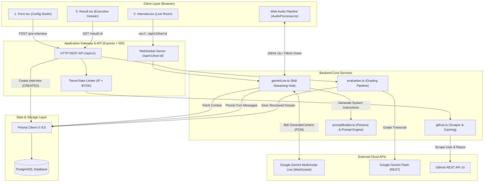

# 01 — System Architecture & High-Level Design

## 1. System Overview

**AI Technical Interviewer** is an open-source platform that conducts fully automated, interactive voice technical screening interviews. Unlike text-based chatbots or static questionnaires, it features:

1. **Bi-directional Low-Latency Voice Streaming**: Sub-second conversational turn-around using the **Google Gemini Multimodal Live API** (`gemini-3.1-flash-live-preview`).
2. **Context-Grounded Technical Questioning**: Dynamic inspection of the candidate's GitHub repositories, READMEs, star counts, and tech stacks to ground technical scenarios on real code they wrote.
3. **Calibrated Staff Engineer Persona ("Alex")**: Rigorous adherence to conversational invariants (2-sentence turns, 3-layer depth drill, dynamic stack anchoring).
4. **Tier-1 Objective Scoring Dossier**: Comprehensive post-interview grading across 4 core engineering competencies with anti-sycophancy gating (`technicalAccuracy < 4.5` caps recommendations at `Lean No Hire`).

---

## 2. End-to-End Architectural Topology



---

## 3. Monorepo Organization

The project is structured as a modern Turborepo monorepo:

```
ai-interviewer/
├── apps/
│   ├── backend/                 # Node/Bun Express & WebSocket server
│   │   ├── generated/prisma/    # Generated Prisma Client runtime
│   │   ├── middleware/          # Rate limiters & security handlers
│   │   ├── prisma/              # Prisma schema & SQL migrations
│   │   ├── routes/              # HTTP endpoint handlers (/api/v1)
│   │   ├── services/            # Core business logic (geminiLive, github, promptBuilder, evaluation)
│   │   ├── config.ts            # Environment validation with strict defaults
│   │   ├── db.ts                # Prisma client instantiation with @prisma/adapter-pg
│   │   ├── index.ts             # Express & WebSocket bootstrap
│   │   └── types.ts             # Zod schemas & TypeScript type contracts
│   └── frontend/                # React 19 + Vite + Tailwind CSS Single-Page App
│       ├── src/
│       │   ├── components/      # Form.tsx, Interview.tsx, Result.tsx, ApiKeyModal.tsx
│       │   ├── lib/             # audioProcessor.ts, audioStorage.ts, webmDurationPatcher.ts, apiKeyStorage.ts, config.ts, utils.ts
│       │   ├── App.tsx          # Root router & layout
│       │   └── index.css        # Tailwind design tokens & typography
│       ├── tests/               # Frontend unit tests (audioProcessor, audioStorage, webmDurationPatcher)
│       ├── build.ts             # Custom Bun production bundler script
│       └── package.json
├── packages/
│   ├── ui/                      # Shared UI components (shadcn/ui primitives)
│   ├── eslint-config/           # Monorepo linting standards
│   └── typescript-config/       # Base tsconfig rules
├── docs/                        # Internal engineering documentation
├── turbo.json                   # Turborepo task pipeline
└── package.json                 # Root monorepo workspace manifest
```

---

## 4. End-to-End Execution Sequence

### Phase 1: Interview Setup & Context Ingestion
1. Candidate opens the setup page (`Form.tsx`), selects **Seniority Level** (`Junior`, `Mid`, `Senior`), and chooses an **Interview Track** (`Full Mock Screen` or one of 8 domain tracks).
2. If GitHub username is supplied:
   - Frontend calls `POST /api/v1/github-preview` to inspect public repositories in real-time.
   - Candidate can target a specific project, select general portfolio mode, or input a custom unlisted repository.
3. Candidate clicks **"Begin Voice Screen"**:
   - Frontend sends `POST /api/v1/pre-interview` with `{ github, experienceLevel, track, selectedRepo }`.
   - Backend scrapes and caches candidate profile details and top repository READMEs via `scrapeGithub()`.
   - Backend creates an `Interview` record in PostgreSQL with status `CREATED` and returns `{ id: interviewId }`.
   - Frontend navigates to `/interview/:interviewId`.

### Phase 2: Live Bi-Directional Audio Session & Local Recording
1. In `Interview.tsx`, the client requests microphone access and connects to `wss://<host>/api/v1/live/:interviewId`.
2. Backend validates the interview ID, retrieves candidate metadata from the database, and sets interview status to `IN_PROGRESS`.
3. `promptBuilder.ts` composes the full system prompt tailored to the candidate's track, seniority level, and GitHub project context.
4. Backend initiates upstream WebSocket connection to `generativelanguage.googleapis.com` (Gemini Live API) with `BidiGenerateContentSetup`.
5. Once Gemini Live confirms `setupComplete`, Alex speaks the opening turn over audio.
6. The candidate speaks into the microphone:
   - `LiveMicrophoneRecorder` captures audio, downsamples to 16kHz mono 16-bit PCM, and transmits base64 chunks over WebSocket.
   - `SessionAudioRecorder` simultaneously captures dual-track audio (mic input + AI playback) inside the native Web Audio DSP graph.
   - Gemini Live streams 24kHz PCM audio chunks back to the backend.
   - Backend forwards PCM audio chunks to the browser, where `LiveAudioPlayer` schedules seamless AudioBuffer playback.
   - User and Assistant transcription turns are continuously persisted into the `Message` table in PostgreSQL.

### Phase 3: Post-Interview Evaluation & Scorecard Dossier
1. Candidate finishes the interview by clicking **"End Interview"**:
   - `SessionAudioRecorder` finalizes the dual-track recording, patches the WebM EBML duration header via `fixWebmDuration()`, and persists the audio Blob into client `IndexedDB` (`audioStorage.ts`).
2. Frontend transitions to `/result/:interviewId` and queries `GET /api/v1/result/:interviewId`.
3. If not already evaluated:
   - Backend sets interview status to `EVALUATING`.
   - `evaluation.ts` compiles the formatted conversation transcript and candidate metadata into the Tier-1 evaluation prompt.
   - Backend calls Google Gemini Flash model with structured JSON schema output.
   - The returned scorecard (overall score, hiring recommendation, executive summary, 4-pillar category grades, evidence quotes, strengths, and improvements) is saved to the database.
   - Status transitions to `COMPLETED`.
4. Frontend renders the **Executive Engineering Dossier** alongside the **Audio Review Console** (scrubber, speed pills $1.0\times\text{--}2.0\times$, and one-click audio download).

---

## 5. Architectural Invariants & Quality Attributes

| Invariant | Implementation Mechanism |
| :--- | :--- |
| **Sub-350ms Turn Latency** | Direct PCM stream over WebSockets without intermediate server-side audio file storage or transcription hops. |
| **Zero-Cost Client Audio Recording** | Native C++ Web Audio graph mixer combines mic + AI playback into `.m4a` (Safari) or `.webm` (Chromium) with EBML duration patching and IndexedDB caching ($0\text{ cloud storage/egress}$). |
| **Anti-Sycophancy Grading** | `technicalAccuracy < 4.5` strictly caps hiring recommendation at `Lean No Hire`, preventing introductory charisma from masking technical gaps. |
| **Zero False Competency** | The anti-spoonfeeding rule awards zero depth credit if the interviewer supplied the technical answer or completed the candidate's sentence. |
| **Resilient Reconnection** | 30-second disconnect grace period preserves the active Gemini session. Past transcript turns are injected upon reconnection. |
| **Zero Secret Leakage** | Candidate-supplied API keys (BYOK) are stored strictly in client `localStorage`, passed via request headers, and never persisted to the database or printed in server logs. |
