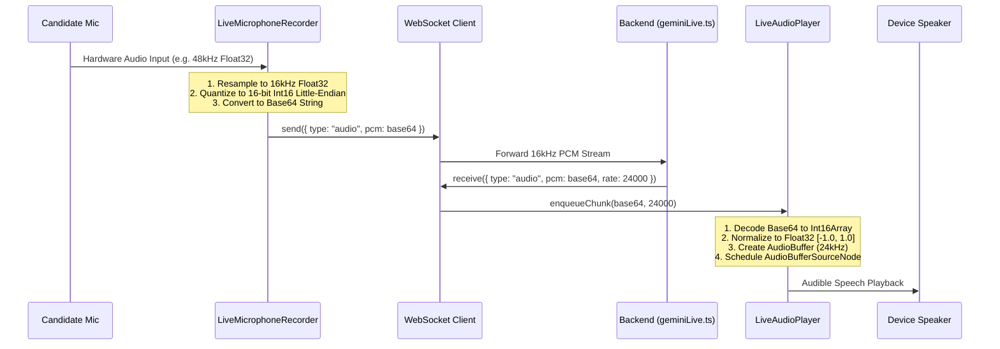
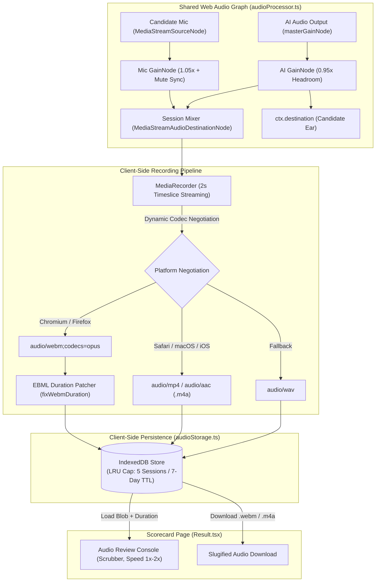

# 02 — Frontend Architecture & Audio Streaming Internals

## 1. Overview & Technology Stack

The frontend is a high-performance Single-Page Application (SPA) built with:
- **React 19** & **TypeScript 5.9**
- **Vite / Custom Bun Bundler**
- **Tailwind CSS** with custom dark-mode design tokens
- **Lucide React** icons & **Sonner** toast notifications
- **Web Audio API** (`AudioContext`, `ScriptProcessorNode`, `AnalyserNode`, `AudioBufferSourceNode`)

---

## 2. Core Component Architecture

```
apps/frontend/src/
├── components/
│   ├── Form.tsx            # Setup Studio & Configuration Screen
│   ├── Interview.tsx       # Live Voice Room with Real-Time Audio
│   ├── Result.tsx          # Minimal Hallmark Executive Engineering Dossier
│   └── ApiKeyModal.tsx     # BYOK Modal with Live Google AI Key Validation
├── lib/
│   ├── audioProcessor.ts   # LiveAudioPlayer & LiveMicrophoneRecorder
│   ├── apiKeyStorage.ts    # Secure client-side key storage & validation
│   ├── config.ts           # Dynamic runtime host & WebSocket URL resolver
│   └── utils.ts            # Tailwind CSS class merging utilities (cn)
├── App.tsx                 # Client-side routing (/ -> /interview/:id -> /result/:id)
└── main.tsx                # React DOM root mounting
```

---

## 3. Screen Breakdown & User Journey

### A. Setup Studio (`Form.tsx`)
1. **Tiered Track Selector**:
   - **Featured Full Mock Hero**: A full 360° interview simulation option covering storytelling, project architecture, live technical scenarios, behavioral leadership, and reverse Q&A.
   - **8 Specialized Domain Tracks**: Full-Stack, Backend, Frontend, System Design, DSA, ML/AI, DevOps, and Behavioral in a responsive 2x4 grid.
2. **Seniority Calibration**:
   - `Junior` (0–2 yrs), `Mid-Level` (2–5 yrs), and `Senior / Lead` (5+ yrs).
3. **Repository Targeting Modes**:
   - *Standard Practice*: No repository required (Alex begins with a 60-second stack warm-up).
   - *GitHub User / Repo URL*: Auto-inspects repositories in real-time (`POST /api/v1/github-preview`).
   - *General Profile Portfolio*: Evaluates architecture across all repositories.
   - *Target Specific / Custom Repo*: Drill down into a specific repository (e.g. `torvalds/linux` or unlisted repos).
4. **Interactive Multi-Step Loading Experience**:
   - Provides reassuring visual step progression during context indexing and room provisioning.

---

### B. Live Voice Room (`Interview.tsx`)
1. **Real-time VoiceOrb RMS Meter**:
   - Dual audio visualizers measuring AI speech and user voice volume levels using `AnalyserNode.getByteTimeDomainData()`.
2. **Live Turn Status Indicators**:
   - Visual states: `Connecting...`, `Alex Speaking`, `Listening to you...`, `Interrupted`, `Reconnecting...`, `Offline`.
3. **Mic Tester & Device Selection**:
   - Pre-flight microphone test to verify browser audio input before beginning the screen.
4. **Network Drop & Reconnection Resilience**:
   - Automatic reconnect loop with exponential backoff if WebSocket connection is lost.
   - Preserves session state and audio hardware listeners during brief Wi-Fi drops.

---

### C. Executive Engineering Dossier (`Result.tsx`)
1. **Single-Page Hallmark Minimal Design**:
   - Prominent composite score (`/10`) + color-coded recommendation badge (`Strong Hire`, `Hire`, `Lean Hire`, `Lean No Hire`, `No Hire`).
   - High-level executive summary detailing declared vs. observed seniority.
2. **4-Pillar Competency Grid**:
   - *Technical Systems*, *Architectural Judgment*, *Storytelling & Articulation*, *Production & Leadership*.
   - Each pillar displays its score (`/10`) with rich diagnostic feedback.
3. **Evidence Quotes & Actionable Growth**:
   - Direct candidate quotes from the transcript with technical assessments.
   - Side-by-side balanced list of Key Strengths and Target Growth Opportunities.
4. **Interactive Transcript Explorer**:
   - Full transcript with turn markers, interruption indicators (`wasInterrupted`), speaker tabs (`All`, `Alex`, `Candidate`), and instant text search.
5. **Scorecard Actions**:
   - Copy scorecard link to clipboard, or generate a print-ready PDF scorecard (`window.print()`).

---

## 4. Web Audio Pipeline Internals (`audioProcessor.ts`)



---

### A. Microphone Capture & Downsampling (`LiveMicrophoneRecorder`)

1. **Hardware Acquisition**:
   ```ts
   this.mediaStream = await navigator.mediaDevices.getUserMedia({
     audio: {
       channelCount: 1,
       echoCancellation: true,
       noiseSuppression: true,
       autoGainControl: true,
     },
   });
   ```
2. **Low-Latency Processing**:
   - Uses `createScriptProcessor(2048, 1, 1)` to capture audio buffers every ~42ms at 48kHz.
3. **Resampling Algorithm**:
   - Converts arbitrary hardware sample rates (44.1kHz, 48kHz, 96kHz) down to **16kHz** via linear interpolation:
   ```ts
   function resampleTo16k(audioData: Float32Array, inputSampleRate: number): Float32Array {
     if (inputSampleRate === 16000) return audioData;
     const ratio = inputSampleRate / 16000;
     const newLength = Math.round(audioData.length / ratio);
     const result = new Float32Array(newLength);
     for (let i = 0; i < newLength; i++) {
       const originalIndex = i * ratio;
       const indexFloor = Math.floor(originalIndex);
       const indexCeil = Math.min(audioData.length - 1, indexFloor + 1);
       const fraction = originalIndex - indexFloor;
       result[i] = audioData[indexFloor]! * (1 - fraction) + audioData[indexCeil]! * fraction;
     }
     return result;
   }
   ```
4. **PCM Quantization (Float32 $\rightarrow$ 16-Bit Little-Endian Base64)**:
   ```ts
   export function float32ToBase64PCM(input: Float32Array): string {
     const len = input.length;
     const bytes = new Uint8Array(len * 2);
     for (let i = 0; i < len; i++) {
       const s = Math.max(-1, Math.min(1, input[i]!));
       const int16 = s < 0 ? s * 0x8000 : s * 0x7fff;
       bytes[i * 2] = int16 & 0xff;
       bytes[i * 2 + 1] = (int16 >> 8) & 0xff;
     }
     // Chunked string encoding prevents call stack overflow
     let binary = "";
     const chunkSize = 0x8000;
     for (let i = 0; i < bytes.length; i += chunkSize) {
       const chunk = bytes.subarray(i, Math.min(i + chunkSize, bytes.length));
       binary += String.fromCharCode.apply(null, chunk as any);
     }
     return window.btoa(binary);
   }
   ```

---

### B. Audio Playback & Queue Scheduling (`LiveAudioPlayer`)

1. **Browser Autoplay & AudioContext Warm-Up**:
   - Modern browsers (specifically Safari and Chrome) block AudioContext initialization unless triggered by a direct user gesture.
   - When the user clicks **"Begin Voice Screen"**, `warmUp()` is called immediately:
     - Instantiates `AudioContext`.
     - Plays a 1ms silent buffer to unlock the audio output hardware.
     - Attaches an `onstatechange` listener to automatically call `resume()` if the browser suspends the context during prolonged silence.
2. **Seamless Buffer Queue Scheduling**:
   - AI audio arrives in discrete 24kHz PCM chunks.
   - `LiveAudioPlayer` schedules each chunk at `nextPlayTime`:
   ```ts
   const now = ctx.currentTime;
   if (this.nextPlayTime < now) {
     this.nextPlayTime = now;
   }
   const startTime = this.nextPlayTime;
   source.start(startTime);
   this.nextPlayTime = startTime + audioBuffer.duration;
   ```
   - This eliminates audio gaps, clicks, and buffer starvation.
3. **Instant Interruption Handling**:
   - When the user interrupts Alex, the backend sends `{ type: "interrupt" }`.
   - `interrupt()` immediately stops and disconnects all `activeSources`, resetting `nextPlayTime` to `ctx.currentTime`.

---

## 5. Garbage Collection & Memory Management

In Web Audio implementations on Chromium and WebKit, audio nodes connected only via JavaScript callbacks can be prematurely garbage collected during conversational pauses.

To guarantee zero audio drops:
- `sourceNode`, `processorNode`, and `silentGainNode` are permanently stored as instance properties on `LiveMicrophoneRecorder`.
- An explicit `silentGainNode` (`gain.value = 0`) connects the processor to `destination` to maintain an active Web Audio graph topology without generating feedback.
- `cleanup()` properly disconnects all nodes, cancels animation frames, stops media tracks, and closes the `AudioContext`.

---

## 6. Dual-Track Client Session Recording (`SessionAudioRecorder`)



### Key Technical Characteristics:
1. **Zero Main-Thread Latency**: Mixing candidate microphone audio and AI playback buffers occurs inside the browser's native C++ Web Audio DSP graph with $0\text{ms}$ delay and zero garbage collection pauses.
2. **Dynamic Codec Negotiation**: Probes `MediaRecorder.isTypeSupported()` to automatically select `.m4a` (`audio/mp4` / `audio/aac`) for Safari/macOS/iOS (ensuring instant Apple QuickTime playback) and `.webm` (`audio/webm;codecs=opus`) for Chromium/Firefox.
3. **Timeline-Preserving Muting**: When candidate toggles mute, `micGain.gain` is set to `0`, continuing to record silence so the conversational timeline remains in lockstep with real time.
4. **2-Second Timeslice Streaming**: `MediaRecorder.start(2000)` flushes buffers every 2 seconds, preventing buffer overflow and ensuring continuous recording when browser tabs are backgrounded.

---

## 7. WebM EBML Duration Header Patcher (`webmDurationPatcher.ts`)

### Problem (Chromium Bug [crbug.com/642012](https://bugs.chromium.org/p/chromium/issues/detail?id=642012))
When `MediaRecorder` writes a streaming WebM file, it creates the container header at the *beginning* of the stream before total duration is known, setting the duration metadata to `Infinity`. As a result, standard HTML5 `<audio>` tags cannot seek or scrub through the audio timeline.

### In-Place Header Patching Solution
`fixWebmDuration()` scans the EBML byte array, locates the `Segment Info` element (`0x1549A966`) and `Duration` tag (`0x4489`), and injects the measured session duration in milliseconds (Big-Endian Float32 or Float64):
```ts
export async function fixWebmDuration(blob: Blob, durationMs: number): Promise<Blob> {
  if (!blob.type.includes("webm")) return blob;
  const arrayBuffer = await blob.arrayBuffer();
  const patchedBuffer = patchEbmlDuration(arrayBuffer, durationMs);
  return new Blob([patchedBuffer], { type: blob.type });
}
```

---

## 8. IndexedDB Audio Storage & LRU Eviction (`audioStorage.ts`)

To support instant replay on the scorecard without third-party cloud storage costs or egress bandwidth, audio recordings are stored in client browser `IndexedDB` (`ai_interviewer_audio_db`):

- **Data Schema**:
  ```ts
  export interface StoredAudioRecording {
    id: string;          // interviewId
    blob: Blob;          // Encoded audio Blob
    mimeType: string;    // e.g. "audio/webm;codecs=opus" or "audio/mp4"
    extension: string;   // "webm" | "m4a" | "wav"
    duration: number;    // Duration in seconds
    timestamp: number;   // Creation timestamp
  }
  ```
- **LRU 5-Session Auto-Eviction**: Enforces a strict cap of the **5 most recent interview recordings** and purges recordings older than 7 days, bounding browser storage consumption strictly $\le 50\text{MB}$.
- **In-Memory Cache Fallback**: Maintains an in-memory Map cache so navigation from `/interview/:id` to `/result/:id` loads instantly even if IndexedDB is restricted.

---

## 9. Audio Review Console on Scorecard (`Result.tsx`)

The results page (`/result/:id`) embeds an **Audio Recording Review** console above the transcript:
- **Interactive Scrubber**: Custom slider with timestamp counter (`02:15 / 14:30`) allowing smooth seeking across the entire interview.
- **Transport Controls**: Play/Pause button with $\pm 5\text{s}$ quick skip.
- **Speed Selectors**: One-click toggles for $1.0\times, 1.25\times, 1.5\times, 2.0\times$ playback rate.
- **Slugified Download Action**: Downloads the recording locally with clean slugified filenames (e.g. `ai-interview-full-mock-screen-35cdddf2.webm`).

