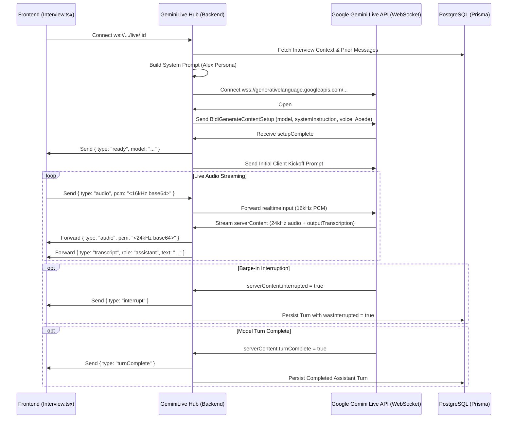

# 03 — Backend Services & Real-Time WebSocket Gateway

## 1. Backend Architecture Overview

The backend is built as a lightweight, high-throughput Node.js / Bun application combining an **Express HTTP REST API** and a **WebSocket Real-Time Gateway** powered by Prisma ORM and the Google Gemini Multimodal Live API.

```
apps/backend/
├── routes/
│   └── interview.ts        # REST endpoints (/verify-key, /github-preview, /pre-interview, /result)
├── services/
│   ├── geminiLive.ts       # Gemini Multimodal Live bi-directional streaming hub
│   ├── github.ts           # GitHub profile & repository scraper with caching & TLS fallback
│   ├── promptBuilder.ts    # Staff Engineer Alex persona & dynamic prompt composer
│   └── evaluation.ts       # Post-interview evaluation engine with model fallback
├── middleware/
│   └── rateLimiter.ts      # Tiered rate limiting & BYOK bypass
├── config.ts               # Environment configuration with Zod validation
├── db.ts                   # Prisma client with PostgreSQL adapter
├── index.ts                # Server bootstrap & WebSocket upgrade router
└── types.ts                # Shared schemas, DTOs & InterviewTrack enums
```

---

## 2. HTTP Server, Security & Rate Limiting (`index.ts` & `middleware/`)

### A. Security & Middleware Configuration
- **Helmet**: Configured with cross-origin resource sharing policies for media streaming.
- **CORS**: Dynamically matches localhost, LAN IP addresses (for local mobile device testing), `.vercel.app` production domains, and configured `CORS_ORIGIN`.
- **Trust Proxy**: Enabled (`app.set("trust proxy", 1)`) to accurately resolve client IP addresses behind reverse proxies (Render, Cloudflare, Vercel).
- **Health Checks (`/health`, `/healthz`)**: Verifies database connectivity (`SELECT 1`), reports memory footprint (RSS/heap), active AI models, and remaining rate limit quotas.

### B. Tiered Rate Limiting Strategy (`rateLimiter.ts`)

| Limiter | Scope | Limit | Bypass Rule |
| :--- | :--- | :--- | :--- |
| **`generalLimiter`** | Global `/api/` endpoints | 100 req/min per IP | None |
| **`interviewCreationLimiter`** | `POST /pre-interview` | Configurable (e.g. 15 per 24h) | Automatically bypassed if candidate provides a valid custom Gemini API key (`x-gemini-api-key` header with length $\ge 15$). |

```ts
export const interviewCreationLimiter = rateLimit({
  windowMs: config.DEMO_RATE_LIMIT_WINDOW_HOURS * 60 * 60 * 1000,
  limit: config.DEMO_DAILY_INTERVIEW_LIMIT,
  skip: (req) => {
    const customKey = (req.headers["x-gemini-api-key"] || req.headers["x-api-key"]) as string | undefined;
    return Boolean(customKey && typeof customKey === "string" && customKey.trim().length >= 15);
  },
  message: {
    message: `You have reached the hosted demo limit. Please provide your own free Gemini API key to continue practicing.`,
  },
});
```

---

## 3. WebSocket Real-Time Gateway (`index.ts` & `geminiLive.ts`)

### A. Connection Upgrade Routing
When a client establishes a WebSocket connection, `index.ts` intercepts the HTTP upgrade request:
```ts
server.on("upgrade", (request, socket, head) => {
  const url = new URL(request.url || "", `http://${request.headers.host}`);
  const match = url.pathname.match(/^\/api\/v1\/live\/([^/]+)$/);
  const interviewId = match ? match[1] : url.searchParams.get("interviewId");
  const customApiKey = request.headers["x-gemini-api-key"] || url.searchParams.get("apiKey");

  if (interviewId) {
    wss.handleUpgrade(request, socket, head, (ws) => {
      wss.emit("connection", ws, request, interviewId, customApiKey);
    });
  } else {
    socket.destroy();
  }
});
```

---

### B. Gemini Multimodal Live Streaming Hub (`geminiLive.ts`)



---

### C. Protocol Payloads & Handshakes

1. **Upstream Handshake Payload (`BidiGenerateContentSetup`)**:
   ```json
   {
     "setup": {
       "model": "models/gemini-3.1-flash-live-preview",
       "generationConfig": {
         "responseModalities": ["AUDIO"],
         "speechConfig": {
           "voiceConfig": {
             "prebuiltVoiceConfig": {
               "voiceName": "Aoede"
             }
           }
         }
       },
       "systemInstruction": {
         "parts": [{ "text": "<COMPOSED_SYSTEM_PROMPT>" }]
       },
       "inputAudioTranscription": {},
       "outputAudioTranscription": {}
     }
   }
   ```
2. **Real-time Client Audio Streaming**:
   ```json
   {
     "realtimeInput": {
       "audio": {
         "mimeType": "audio/pcm;rate=16000",
         "data": "<BASE64_PCM_16K_CHUNK>"
       }
     }
   }
   ```

---

### D. Session Reconnection & 30-Second Grace Period

To ensure network reliability during transient client Wi-Fi interruptions:
1. **Grace Period Holding**: When a client socket closes unexpectedly, the active session is retained in memory (`activeSessions` map) for 30 seconds rather than terminating immediately.
2. **Socket Re-binding**: If the client reconnects within 30 seconds, `attachClient(newClientWs)` rebinds the client socket, cancels the grace timer, and sends `{ type: "reconnected" }`.
3. **Context Continuation on Server Restart**: If reconnecting after the grace period or after a backend restart, `geminiLive.ts` loads previous conversation turns from PostgreSQL and injects them into the system prompt:
   ```
   ### CONVERSATION CONTINUATION NOTICE:
   This is a continuation of an ongoing live interview that was temporarily disconnected.
   Do NOT introduce yourself again.
   Acknowledge the candidate's return naturally in ONE sentence, and resume the technical drill.
   ```

---

## 4. GitHub Scraper & Ingestion Engine (`github.ts`)

The GitHub service extracts high-value technical context to ground interview questions:

1. **Defensive Input Parsing (`parseGithubInput`)**:
   - Handles full URLs (`https://github.com/user/repo`), SSH strings (`git@github.com:...`), `@mentions`, query parameters, and subpaths.
   - Gracefully defaults empty strings or generic names to `"candidate"`.
2. **Repository Ranking & Selection**:
   - Fetches user metadata and up to 20 recently updated repositories.
   - Sorts non-forked repositories first, ranked by stars descending.
   - If the candidate targeted a specific repository, it is elevated to the top of the context list.
3. **README Extraction & HTML Sanitization**:
   - Fetches raw README content (`application/vnd.github.v3.raw`).
   - Strips raw HTML tags and truncates to 2,000 characters to keep LLM context concise.
4. **In-Memory TTL Caching**:
   - Caches profile previews for 10 minutes (`CACHE_TTL_MS = 10 * 60 * 1000`) to prevent API rate limits.
5. **TLS Network Reset Upstream Proxy**:
   - If local development suffers an ISP TLS reset (e.g. `SSL_ERROR_SYSCALL` or certificate error), it seamlessly falls back to the cloud proxy (`https://ai-interviewer-backend-6jio.onrender.com/api/v1/github-preview`).
