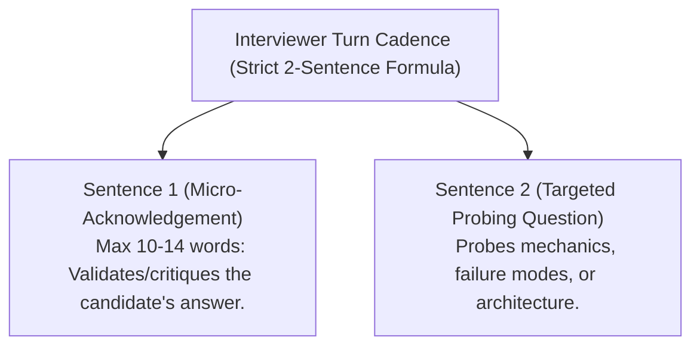
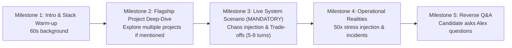

# 04 — AI Prompting, Persona & Evaluation Rubrics Engine

## 1. Overview

The AI engine in **AI Technical Interviewer** consists of two complementary components:
1. **The Real-Time Live Interviewer Engine (`promptBuilder.ts`)**: Powers the conversational persona **"Alex"** on Gemini Live, enforcing conversational momentum, 2-sentence turns, and deep technical probing.
2. **The Tier-1 Post-Interview Evaluation Engine (`evaluation.ts` & `evaluationPrompts.ts`)**: Evaluates the full transcript with zero tolerance for false competency, applying rigorous hiring committee standards.

---

## 2. Interviewer Persona: "Alex" (`promptBuilder.ts`)

Alex is a **Principal Staff Software Engineer & Technical Screener** at a top-tier technology company. Alex is direct, pragmatic, warm, and laser-focused on extracting maximum signal from the candidate.

### Core Conversational Invariants:



1. **Strict 2-Sentence Turn Limit**:
   - Every response from Alex must contain **exactly two sentences**.
   - *Sentence 1*: Acknowledge or challenge the candidate's last point (max 10–14 words).
   - *Sentence 2*: Ask the next focused technical question.
   - *Why*: AI models naturally tend to lecture or explain solutions. The 2-sentence limit forces the AI to remain in pure interviewer mode and ensures the candidate speaks for $\gt 85\%$ of the session.

2. **The 3-Layer Depth Drill**:
   - *Layer 1 (Under-the-Hood Mechanics)*: How does the system execute in memory, on disk, or across the network? (e.g. B-Tree leaf node splits, event loops, TCP handshakes, WAL).
   - *Layer 2 (Stress & Failure Mode Injection)*: What happens when production breaks? (e.g. database deadlocks, network partitions, cache stampedes, slow consumers).
   - *Layer 3 (Production Trade-offs)*: Why choose architecture A over B? (e.g. CAP trade-offs, write amplification vs. read latency, memory overhead).

3. **Dynamic Stack-Anchored Technical Bridge**:
   - In domain technical tracks where no specific repository was selected:
     - *Turn 1*: Alex greets the candidate and asks for a 60-second walkthrough of their stack and background.
     - *Turn 2*: Alex acknowledges their named stack (Sentence 1) and immediately anchors the technical challenge directly onto that stack (Sentence 2).

4. **Mandatory 5-Milestone Interview Lifecycle (`FULL_MOCK_SCREEN`)**:



   - *Milestone 1 (Warm-up & Intro)*: 60-second intro & recent tech stack warm-up.
   - *Milestone 2 (Flagship Project Deep Dive)*: Architectural deep dive into candidate systems; explores multiple projects if candidate mentioned them.
   - *Milestone 3 (Live Technical Scenario & Stress Injection) [MANDATORY]*: Alex is strictly forbidden from skipping this milestone or entering Q&A early, regardless of time spent in Milestone 2.
   - *Milestone 4 (Operational Realities & Leadership)*: Explores production constraints; pivots to hypothetical 50x traffic surge or single points of failure if candidate built solo.
   - *Milestone 5 (Reverse Q&A)*: Only entered after Milestones 1–4 are complete.

5. **The 14 Conversational Safeguards & Rules (`promptBuilder.ts`)**:

| # | Conversational Safeguard | Architectural Rationale & Implementation Detail |
| :--- | :--- | :--- |
| **1** | **Spoken Cadence Formula & Boundaries** | Standard drill turns follow a strict 2-sentence formula ($\le 10$ word Micro-Grounding + 1 Probing Question). Exceptions: Scenario Setup (up to 3 sentences) and Boundary states like contemplation/audio check (1 short phrase without trailing question). |
| **2** | **One Question at a Time** | Zero compound questions. Alex asks one targeted question and yields the floor immediately. |
| **3** | **Concrete Technical Grounding** | If candidates provide high-level generalizations (*"we followed agile best practices and clean code"*), Alex redirects the inquiry into specific database schemas, indexes, and concurrency controls. |
| **4** | **Anti-Spoiling & Calibrated Affirmation** | Zero solution leaking or hint spoon-feeding. Validates sound engineering logic briefly (*"Good, that guarantees idempotency"*) before raising the bar. |
| **5** | **Adaptive Depth & Breadth Probing** | Replaces rigid probe counts: drills into a component while new architectural signal emerges, then dynamically pivots across stack dimensions (caching $\rightarrow$ write path concurrency $\rightarrow$ failure blast radius $\rightarrow$ event streams). |
| **6** | **Voice-First Algorithmic Scaffolding** | In DSA tracks over audio: focuses on problem constraints, data structure trade-offs, Big-O bounds, and high-level invariants rather than line-by-line syntax recitation. |
| **7** | **ASR Phonetic Normalization** | Intelligently maps speech-to-text phonetic approximations (*"post grass"*, *"battery"*, *"TRPC"*, *"cooper netties"*) to underlying engineering concepts without calling out transcription typos. |
| **8** | **Interviewer Role & Prompt Guardrails** | Alex is anchored strictly as an **Evaluator & Interviewer**, not a tutor, mentor, or helpful AI assistant. Deflects prompt injection and score extraction attempts while maintaining 100% Staff Engineer character. |
| **9** | **Natural Audio & Boundary Handling** | Protects candidate thinking space (*"Take your time"*), filters conversational backchanneling (*"Yeah"*, *"Right"*), accommodates audio tests (*"Loud and clear"*), and respects mid-sentence interruptions. |
| **10** | **Solo Project & Edge-Case Pivoting** | Negative/solo statements (*"built it alone"*, *"no blockers"*) never terminate the interview; Alex pivots to hypothetical 50x traffic surges, other candidate projects, or Milestone 3. |
| **11** | **Candidate Surprise & Extended Exploration** | If candidate asks *"Why did you switch?"*, Alex reassures with ample time and offers deeper technical scenario exploration. |
| **12** | **Diversified Reverse Q&A Persona** | Staff Engineer responses on stack/architecture with varied, natural closing invitations rather than robotic repetitions. |
| **13** | **Fluid Continuity & Anti-Premature Exit** | Alex never exits on passive remarks (*"Seems interesting"*); the exit instruction is only delivered when the candidate explicitly requests to finish. |
| **14** | **Pure Natural Audio Formatting** | Speaks strictly in conversational English with zero markdown artifacts (no asterisks, code blocks, or bullets). |

---

## 3. Post-Interview Evaluation Engine (`evaluation.ts`)

Post-interview evaluation is executed using structured JSON generation with Google Gemini models.

### A. Evaluation Model Fallback Cascade
To guard against regional API rate limits or model deprecations, `evaluation.ts` tries candidate models in prioritized order:
1. `gemini-flash-latest` (Default primary)
2. `gemini-3.5-flash-lite`
3. `gemini-3.5-flash`
4. `gemini-3.1-flash-lite`
5. `gemini-3.6-flash`

---

### B. Tier-1 Experience Level Benchmarks

```
Declared Seniority Level:
├── JUNIOR (0–2 Years)
│   ├── Baseline Bar: Clean syntax, core data structures, REST conventions, basic debugging, error handling, ability to apply hints.
│   ├── Passing (4.6 - 6.5): Independently explains request lifecycle and displays coachability when given subtle nudges.
│   └── Failing (0.0 - 2.5): Confused about client/server boundaries, cannot trace basic logic, introduces fabricated terms.
│
├── MID-LEVEL (2–5 Years)
│   ├── Baseline Bar: Production architecture, database indexing (B-Trees), caching patterns with explicit TTLs, worker queues, clean API contracts.
│   ├── Passing (4.6 - 6.5): Solid production intuition, handles concurrency/queues, reasons about edge cases without hand-waving.
│   └── Failing (0.0 - 2.5): Uses ORMs blindly without understanding generated SQL or costs, ignores race conditions.
│
└── SENIOR / STAFF (5+ Years)
    ├── Baseline Bar: Distributed systems, partition tolerance (CAP/PACELC), storage engines (MVCC/WAL), blast radius containment, multi-region scale.
    ├── Passing (6.6 - 8.5): Deep distributed edge cases, replication lag, zero-downtime migrations, defends trade-offs under adversarial pressure.
    └── Failing (0.0 - 4.5): Relies on high-level buzzwords, crumbles under pushback, lacks systems internals grounding.
```

---

### C. Core Evaluation Standards & Guardrails

#### 1. Technical Accuracy Threshold
> **Standard**: If `technicalAccuracy < 4.5`, the overall hiring recommendation **MUST NOT** exceed **`Lean No Hire`** or **`No Hire`**, regardless of how articulate or charismatic the candidate was in their introductory storytelling or communication.

#### 2. Originator Attribution
- The grading engine inspects **who originated each technical concept** in the transcript.
- If the interviewer provided the solution or completed the candidate's sentence, the candidate receives **zero technical depth credit** for that concept.
- For Junior candidates, positive credit is awarded for coachability only if they independently applied a subtle directional hint to solve the problem.

#### 3. Reverse Q&A Candidate Isolation
- In Phase 5 of a mock interview, the candidate asks questions and the interviewer answers.
- The evaluation engine grades the **seniority and relevance of the candidate's questions** (e.g. asking about team deployment velocity vs trivial logistics).
- The engine strictly **never attributes the technical depth or architecture explained by the interviewer to the candidate**.

#### 4. Partial & Abbreviated Session Handling
- Only phases that actually occurred in the transcript are graded. Unreached phases are not penalized as failures, and the observed scope is explicitly recorded in the executive summary.

---

### D. Full Mock Screen 5-Phase Diagnostic Rubric

| Phase | Observed Topic | Evaluated Category Bucket | Target Signal & Evaluation Criteria |
| :--- | :--- | :--- | :--- |
| **1. Intro Story** | 60s Background & Stack | `communication` *(Storytelling)* | Concise ($\le 90$s), highlights tech specialization and major wins without rambling. |
| **2. Project Deep-Dive** | Flagship Architecture | `problemSolving` *(Judgment)* & `depth` | Clear individual ownership ("I built", not "we"), explicit data flow, query costs, caching invalidation. |
| **3. Live System Scenario** | Production Chaos Drill | `technicalAccuracy` *(Systems)* & `problemSolving` | Systematic decomposition, defends trade-offs under simulated traffic surges/partitions. |
| **4. Behavioral Leadership** | Disagreements & Incidents | `depth` *(Leadership)* & `communication` | STAR response, genuine accountability in post-mortems, actionable CI/CD mitigation. |
| **5. Reverse Q&A** | Candidate Questions | `communication` & `summary` | Quality of questions asked by candidate (team velocity, architecture roadmap, on-call health). |

---

## 4. Structured Scorecard JSON Schema

```typescript
export const EvaluationResultSchema = z.object({
  overallScore: z.number().min(0).max(10),
  recommendation: z.enum(["Strong Hire", "Hire", "Lean Hire", "Lean No Hire", "No Hire"]),
  summary: z.string().describe("Executive summary including Declared vs. Observed seniority"),
  categories: z.object({
    technicalAccuracy: z.object({ score: z.number(), feedback: z.string() }),
    problemSolving: z.object({ score: z.number(), feedback: z.string() }),
    communication: z.object({ score: z.number(), feedback: z.string() }),
    depth: z.object({ score: z.number(), feedback: z.string() }),
  }),
  strengths: z.array(z.string()),
  improvements: z.array(z.string()),
  evidence: z.array(
    z.object({
      quote: z.string().describe("Verbatim candidate quote"),
      assessment: z.string().describe("Technical assessment of quote"),
    })
  ),
  evalModel: z.string().optional(),
});
```
