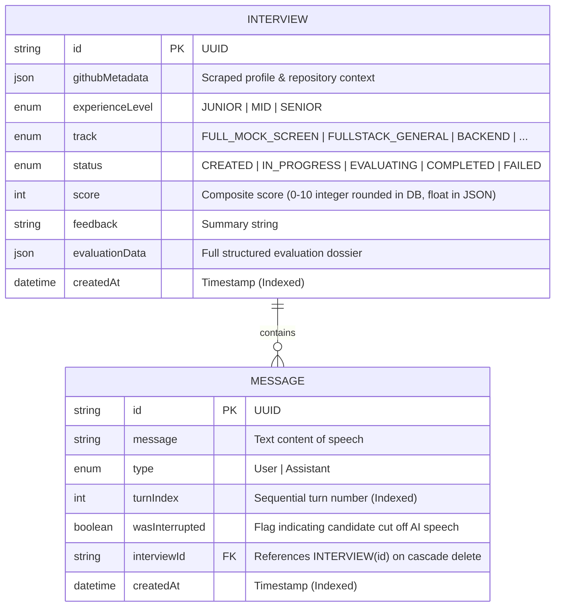
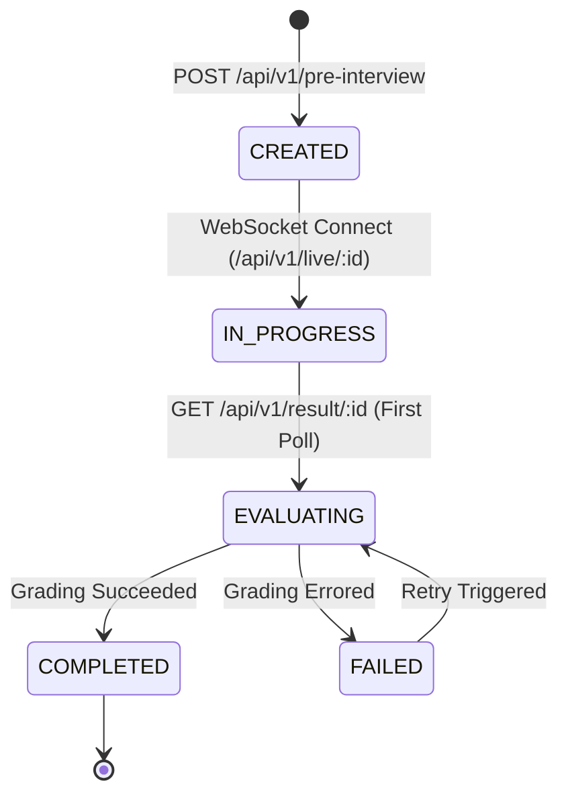
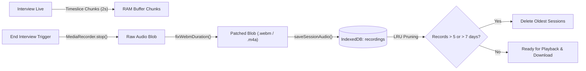

# 05 — Database Schema, Models & State Lifecycle

## 1. Database Architecture

The data tier is powered by **PostgreSQL** managed through **Prisma ORM** (`v7.8.0`) with `@prisma/adapter-pg`.



---

## 2. Prisma Schema Definition (`schema.prisma`)

```prisma
datasource db {
  provider = "postgresql"
}

generator client {
  provider = "prisma-client"
  output   = "../generated/prisma"
}

model Interview {
  id                String          @id @default(uuid())
  githubMetadata    Json
  experienceLevel   ExperienceLevel @default(MID)
  track             InterviewTrack  @default(FULL_MOCK_SCREEN)
  status            InterviewStatus @default(CREATED)
  score             Int             @default(0)
  conversations     Message[]
  feedback          String?
  evaluationData    Json?
  createdAt         DateTime        @default(now())

  @@index([status])
  @@index([createdAt])
}

model Message {
  id              String      @id @default(uuid())
  message         String
  type            MessageType
  turnIndex       Int         @default(0)
  wasInterrupted  Boolean     @default(false)
  interviewId     String
  interview       Interview   @relation(fields: [interviewId], references: [id], onDelete: Cascade)
  createdAt       DateTime    @default(now())

  @@index([interviewId, createdAt])
  @@index([interviewId, turnIndex])
}

enum MessageType {
  User
  Assistant
}

enum InterviewStatus {
  CREATED
  IN_PROGRESS
  EVALUATING
  COMPLETED
  FAILED
}

enum ExperienceLevel {
  JUNIOR
  MID
  SENIOR
}

enum InterviewTrack {
  FULL_MOCK_SCREEN
  FULLSTACK_GENERAL
  BACKEND
  FRONTEND
  SYSTEM_DESIGN
  DSA
  BEHAVIORAL
  DEVOPS_CLOUD
  ML_AI
}
```

---

## 3. Interview State Machine



1. **`CREATED`**:
   - Initialized by `POST /api/v1/pre-interview`.
   - Stores candidate GitHub context, seniority, and track in PostgreSQL.
2. **`IN_PROGRESS`**:
   - Triggered when the browser connects to the WebSocket endpoint `/api/v1/live/:interviewId`.
   - Audio chunks stream in real-time; speech turns are sequentially written to the `Message` table.
3. **`EVALUATING`**:
   - Triggered when candidate completes the interview and navigates to `/result/:interviewId`.
   - Prevents duplicate parallel evaluation runs if multiple clients or tabs poll the result endpoint simultaneously.
4. **`COMPLETED`**:
   - Post-interview evaluation grading finishes successfully.
   - Overall score, feedback summary, and full structured JSON (`evaluationData`) are saved.
5. **`FAILED`**:
   - If an unexpected error occurs during AI grading, status is reset to `FAILED` instead of leaving the interview locked in `EVALUATING`.
   - Allows the frontend to present a clean retry button rather than spinning indefinitely.

---

## 4. Asynchronous Database Write Queue (`geminiLive.ts`)

During real-time voice streaming, persisting transcription turns to PostgreSQL must never block the low-latency WebSocket audio pipeline.

`geminiLive.ts` implements a promise-chained serial write queue:

```ts
let dbWriteQueue = Promise.resolve();
let turnSequence = 0;

function persistTurn(type: "User" | "Assistant", message: string, wasInterrupted = false) {
  const text = message.trim();
  if (!text) return;

  turnSequence++;
  const currentTurnIndex = turnSequence;

  dbWriteQueue = dbWriteQueue.then(async () => {
    try {
      await prisma.message.create({
        data: {
          interviewId,
          type,
          message: text,
          turnIndex: currentTurnIndex,
          wasInterrupted,
        },
      });
    } catch (e) {
      console.error(`[GeminiLive] Error persisting Turn #${currentTurnIndex}:`, e);
    }
  });
}
```

### Key Guarantees:
- **Strict Turn Ordering**: Even if asynchronous DB queries complete with varying network latencies, turns are inserted sequentially based on `turnSequence`.
- **Zero Audio Jitter**: Database I/O is non-blocking with respect to the WebSocket event loop.
- **Interruption Tagging**: If a candidate speaks while Alex is talking, the partial Assistant transcript is persisted with `wasInterrupted: true` for downstream evaluation review.

---

## 5. Client-Side Audio Recording Storage Lifecycle (`audioStorage.ts`)

While text transcripts, scores, and evaluation rubrics are persisted in PostgreSQL, raw full-session audio recordings are managed entirely on the client side via browser **IndexedDB** (`ai_interviewer_audio_db`):



### Key Architectural Advantages:
1. **Zero Cloud Storage & Egress Costs**: Eliminates AWS S3 / Cloudflare R2 hosting and bandwidth fees.
2. **Deterministic Timeline Alignment**: Audio is captured directly from the local hardware `AudioContext`, eliminating network packet jitter or audio drift.
3. **Bounded Client Disk Footprint**: The LRU 5-session cap and 7-day TTL guarantee client storage stays strictly under $\le 50\text{MB}$.

