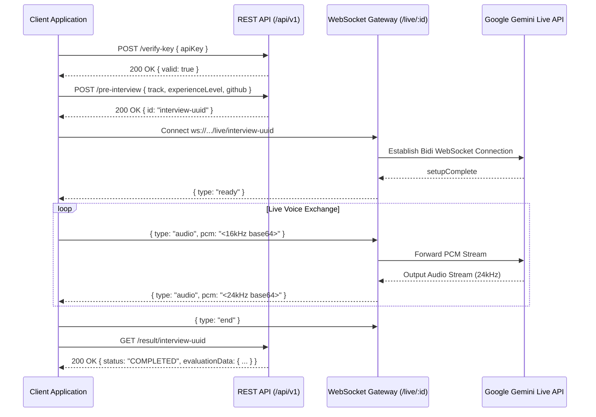

# 08 — Complete API & Real-Time WebSocket Reference

## 1. Overview & Base URLs

The **AI Technical Interviewer** backend exposes both a **REST HTTP API** for session management and evaluation, and a **Bidirectional WebSocket API** for low-latency streaming voice communication.

- **Base REST URL (Local)**: `http://localhost:3001/api/v1`
- **Base REST URL (Production)**: `https://ai-interviewer-backend-6jio.onrender.com/api/v1`
- **Base WebSocket URL (Local)**: `ws://localhost:3001/api/v1/live/:interviewId`
- **Base WebSocket URL (Production)**: `wss://ai-interviewer-backend-6jio.onrender.com/api/v1/live/:interviewId`



---

## 2. Authentication & Custom Headers

The API supports both a **Hosted Demo Tier** (with rate limits) and a **Bring-Your-Own-Key (BYOK)** tier (unlimited practice):

| Header Name | Type | Description |
| :--- | :--- | :--- |
| `x-gemini-api-key` | String | Optional. Google Gemini API key from [Google AI Studio](https://aistudio.google.com/). Bypasses demo rate limits. |
| `x-api-key` | String | Alternative alias for `x-gemini-api-key`. |
| `Content-Type` | String | Must be `application/json` for POST requests. |

---

## 3. Health & Telemetry Endpoints

### `GET /health` & `GET /healthz`
Returns system status, active database connectivity, memory utilization, and rate limit quotas.

#### Request Example:
```bash
curl -X GET http://localhost:3001/health
```

#### Response (200 OK):
```json
{
  "status": "healthy",
  "timestamp": "2026-08-23T20:30:00.000Z",
  "uptimeSeconds": 3600,
  "services": {
    "database": "connected",
    "geminiLiveModel": "gemini-3.1-flash-live-preview",
    "geminiEvalModel": "gemini-flash-latest"
  },
  "quota": {
    "demoDailyLimit": 15,
    "windowHours": 24
  },
  "memory": {
    "rssMB": 85.24,
    "heapUsedMB": 42.15
  }
}
```

---

## 4. REST API Endpoints (`/api/v1`)

### 1. Verify Gemini API Key
`POST /api/v1/verify-key`

Performs a lightweight pre-flight ping against Google AI Studio to verify whether a user-supplied API key is valid and has active quotas.

#### Request Body:
```json
{
  "apiKey": "AIzaSyD..."
}
```

#### Response (200 OK - Valid Key):
```json
{
  "valid": true,
  "modelsCount": 14
}
```

#### Response (400 / 403 / 429 - Invalid or Rate Limited Key):
```json
{
  "valid": false,
  "error": "Google rejected this key: API_KEY_INVALID. Please check your key in Google AI Studio."
}
```

---

### 2. GitHub Profile & Repository Preview
`POST /api/v1/github-preview`

Extracts public repositories, star counts, primary languages, and descriptions for a given GitHub username or repository URL. Results are cached in memory for 10 minutes.

#### Request Body:
```json
{
  "github": "torvalds"
}
```

#### Response (200 OK):
```json
{
  "username": "torvalds",
  "name": "Linus Torvalds",
  "bio": "Creator of Linux and Git",
  "avatarUrl": "https://avatars.githubusercontent.com/u/1024025?v=4",
  "publicReposCount": 7,
  "repos": [
    {
      "name": "linux",
      "description": "Linux kernel source tree",
      "language": "C",
      "stars": 195000,
      "url": "https://github.com/torvalds/linux"
    }
  ],
  "rateLimited": false,
  "error": null
}
```

---

### 3. Initialize Interview Session
`POST /api/v1/pre-interview`

Ingests candidate configuration, scrapes repository architecture/READMEs, creates an `Interview` record in PostgreSQL with status `CREATED`, and returns a unique interview ID.

#### Rate Limiting:
Subject to `DEMO_DAILY_INTERVIEW_LIMIT` (15 per 24h per IP) unless `x-gemini-api-key` header is provided.

#### Request Headers:
```http
Content-Type: application/json
x-gemini-api-key: AIzaSy... (optional)
```

#### Request Body:
```json
{
  "github": "candidate",
  "experienceLevel": "SENIOR",
  "track": "FULL_MOCK_SCREEN",
  "selectedRepo": "distributed-cache"
}
```

| Parameter | Type | Required | Values / Defaults |
| :--- | :--- | :--- | :--- |
| `github` | String | No | GitHub username or URL. Defaults to `"candidate"`. |
| `experienceLevel` | String | No | `"JUNIOR"` \| `"MID"` \| `"SENIOR"`. Defaults to `"MID"`. |
| `track` | String | No | `"FULL_MOCK_SCREEN"` \| `"FULLSTACK_GENERAL"` \| `"BACKEND"` \| `"FRONTEND"` \| `"SYSTEM_DESIGN"` \| `"DSA"` \| `"BEHAVIORAL"` \| `"DEVOPS_CLOUD"` \| `"ML_AI"`. Defaults to `"FULL_MOCK_SCREEN"`. |
| `selectedRepo` | String | No | Target repository name or `null`. |

#### Response (200 OK):
```json
{
  "id": "e9b23b12-9844-42b7-84bc-87c2b5ec1234"
}
```

#### Error Response (429 Rate Limit Exceeded):
```json
{
  "message": "You have reached the hosted demo limit (15 interviews per 24h). Please provide your own free Gemini API key to continue practicing."
}
```

---

### 4. Fetch & Trigger Evaluation Scorecard
`GET /api/v1/result/:interviewId`

Retrieves the evaluation dossier for a completed interview. If the interview has not yet been graded, this endpoint atomically triggers the evaluation pipeline via Google Gemini and returns the scorecard.

#### Request Headers:
```http
x-gemini-api-key: AIzaSy... (optional)
```

#### Response (200 OK - Evaluation In Progress):
```json
{
  "id": "e9b23b12-9844-42b7-84bc-87c2b5ec1234",
  "status": "EVALUATING",
  "message": "Evaluation is currently in progress...",
  "experienceLevel": "SENIOR",
  "track": "FULL_MOCK_SCREEN",
  "transcript": [...]
}
```

#### Response (200 OK - Evaluation Completed):
```json
{
  "id": "e9b23b12-9844-42b7-84bc-87c2b5ec1234",
  "status": "COMPLETED",
  "score": 8,
  "feedback": "Candidate demonstrated exceptional distributed systems mastery and clean trade-off defense under pushback.",
  "experienceLevel": "SENIOR",
  "track": "FULL_MOCK_SCREEN",
  "evaluationData": {
    "overallScore": 8.4,
    "recommendation": "Strong Hire",
    "summary": "Candidate demonstrated clear Staff-level distributed systems judgment. Declared: SENIOR | Observed: Senior capability.",
    "categories": {
      "technicalAccuracy": {
        "score": 8.5,
        "feedback": "Deep command of PostgreSQL WAL, B-Tree indexes, and partition tolerance mechanics."
      },
      "problemSolving": {
        "score": 8.5,
        "feedback": "Structured decomposition of cache stampede failure modes with explicit TTL jitter."
      },
      "communication": {
        "score": 8.0,
        "feedback": "Concise 60-second background delivery and structured STAR responses."
      },
      "depth": {
        "score": 8.5,
        "feedback": "Grounded trade-off analysis on write amplification and multi-region replication lag."
      }
    },
    "strengths": [
      "Independently designed cache invalidation with probabilistic early expiration.",
      "Defended database partitioning strategies under simulated traffic surges."
    ],
    "improvements": [
      "Explore Raft consensus leader election edge cases in split-brain scenarios."
    ],
    "evidence": [
      {
        "quote": "We implemented probabilistic early expiration to prevent the thundering herd problem.",
        "assessment": "Demonstrates authentic production engineering depth on cache stampede mitigation."
      }
    ],
    "evalModel": "gemini-flash-latest"
  },
  "transcript": [
    {
      "type": "Assistant",
      "content": "Hey Chirag, great to meet you! I'm Alex. To kick things off, give me a quick 60-second walkthrough of your engineering background.",
      "turnIndex": 1,
      "wasInterrupted": false,
      "createdAt": "2026-08-23T20:31:00.000Z"
    },
    {
      "type": "User",
      "content": "I'm a backend engineer specializing in distributed caching and high-throughput Go services.",
      "turnIndex": 2,
      "wasInterrupted": false,
      "createdAt": "2026-08-23T20:31:15.000Z"
    }
  ]
}
```

---

## 5. Real-Time WebSocket Streaming API

Connects the client to the live voice interview room powered by the Gemini Multimodal Live API.

- **WebSocket URL**: `ws://<host>/api/v1/live/:interviewId` (or `wss://...` in production)
- **Authentication**: Can be passed via `x-gemini-api-key` header during upgrade or query parameter `?apiKey=AIza...`

---

### A. Client $\rightarrow$ Server Messages

#### 1. Stream Audio Chunk (PCM 16kHz)
Transmits raw 16kHz mono 16-bit PCM microphone audio chunk from the browser to Gemini Live.
```json
{
  "type": "audio",
  "pcm": "<BASE64_ENCODED_INT16_PCM_DATA>"
}
```

#### 2. Heartbeat Ping
Keeps the WebSocket connection alive and measures network round-trip time.
```json
{
  "type": "ping"
}
```

#### 3. Explicit End Session
Signals to the server that the candidate has completed or closed the interview.
```json
{
  "type": "end"
}
```

---

### B. Server $\rightarrow$ Client Messages

#### 1. Ready Handshake
Sent when upstream Gemini Live `setupComplete` event has been verified.
```json
{
  "type": "ready",
  "model": "gemini-3.1-flash-live-preview"
}
```

#### 2. Reconnected Handshake
Sent when a disconnected client successfully rebinds within the 30-second grace period.
```json
{
  "type": "reconnected",
  "model": "gemini-3.1-flash-live-preview"
}
```

#### 3. Audio Chunk Output (PCM 24kHz)
Transmits 24kHz Int16 raw PCM audio chunks generated by Alex's voice for browser playback.
```json
{
  "type": "audio",
  "pcm": "<BASE64_ENCODED_INT16_PCM_24K_DATA>",
  "mimeType": "audio/pcm;rate=24000"
}
```

#### 4. Streaming Real-Time Transcript
Transmits incremental speech-to-text transcription for visual feedback.
```json
{
  "type": "transcript",
  "role": "assistant",
  "text": "Tell me how you handled cache invalidation."
}
```

#### 5. Interruption / Barge-in
Sent when the candidate speaks over Alex, commanding the client to immediately cut off AI audio playback.
```json
{
  "type": "interrupt"
}
```

#### 6. Turn Complete
Sent when Alex has finished speaking a turn and the system transitions to listening.
```json
{
  "type": "turnComplete"
}
```

#### 7. Heartbeat Pong
Response to client ping.
```json
{
  "type": "pong"
}
```

#### 8. Upstream Error
Sent if an upstream Gemini or database error occurs.
```json
{
  "type": "error",
  "message": "Live audio upstream connection error"
}
```

---

## 6. End-to-End Integration Code Example (Node.js / TypeScript)

```typescript
import axios from "axios";
import WebSocket from "ws";

async function runProgrammaticInterview() {
  const BACKEND_URL = "http://localhost:3001";

  // 1. Initialize interview session
  const initRes = await axios.post(`${BACKEND_URL}/api/v1/pre-interview`, {
    github: "candidate",
    experienceLevel: "MID",
    track: "BACKEND",
  });

  const interviewId = initRes.data.id;
  console.log(`Initialized Interview: ${interviewId}`);

  // 2. Connect to live WebSocket room
  const ws = new WebSocket(`ws://localhost:3001/api/v1/live/${interviewId}`);

  ws.on("open", () => {
    console.log("WebSocket connected. Waiting for ready signal...");
  });

  ws.on("message", (data) => {
    const msg = JSON.parse(data.toString());
    if (msg.type === "ready") {
      console.log("Alex is ready and speaking opening turn!");
    } else if (msg.type === "transcript") {
      console.log(`[${msg.role}]: ${msg.text}`);
    }
  });

  // 3. To conclude session and trigger evaluation:
  // ws.send(JSON.stringify({ type: "end" }));
  // const evalRes = await axios.get(`${BACKEND_URL}/api/v1/result/${interviewId}`);
  // console.log("Final Grade:", evalRes.data.evaluationData.overallScore);
}
```
