# 10 — Complete System Architecture, Data Flow Diagrams & Interview Master Reference

This document serves as the **definitive architectural blueprint, data flow reference, and interview study guide** for the AI Technical Interviewer platform. It covers high-level system topology, low-level DSP audio engineering, button-click lifecycle flows, concurrency patterns, AI evaluation pipelines, and database mechanics.

---

# Table of Contents
- [Chapter 1: Macro System Architecture, Topologies & Network Protocols](#chapter-1-macro-system-architecture-topologies--network-protocols)
  - [1.1 High-Level System Topology (The 10,000-Foot View)](#11-high-level-system-topology-the-10000-foot-view)
  - [1.2 Client-Server-Cloud Protocol & Network Map](#12-client-server-cloud-protocol--network-map)
  - [1.3 End-to-End User Journey Macro State Machine](#13-end-to-end-user-journey-macro-state-machine)
  - [1.4 Production Deployment & Reverse Proxy Architecture](#14-production-deployment--reverse-proxy-architecture)
- [Chapter 2: Frontend Component Architecture, State & React Tree](#chapter-2-frontend-component-architecture-state--react-tree)
  - [2.1 React Component Tree & DOM Hierarchy](#21-react-component-tree--dom-hierarchy)
  - [2.2 Frontend State & Hardware Hook Lifecycle](#22-frontend-state--hardware-hook-lifecycle)
  - [2.3 AudioContext Unlock, Gesture Warm-Up & onstatechange Auto-Resume](#23-audiocontext-unlock-gesture-warm-up--onstatechange-auto-resume)
  - [2.4 60 FPS VoiceOrb RMS Energy Visualizer Pipeline](#24-60-fps-voiceorb-rms-energy-visualizer-pipeline)
  - [2.5 Executive Scorecard & Audio Review Console Anatomy](#25-executive-scorecard--audio-review-console-anatomy)
- [Chapter 3: Backend Services, WebSocket Hub & Concurrency](#chapter-3-backend-services-websocket-hub--concurrency)
  - [3.1 Backend Layered Architecture & Modular Pipeline](#31-backend-layered-architecture--modular-pipeline)
  - [3.2 Full-Duplex WebSocket Gateway Hub (geminiLive.ts)](#32-full-duplex-websocket-gateway-hub-geminilivets)
  - [3.3 Upstream Gemini Live Handshake (BidiGenerateContentSetup)](#33-upstream-gemini-live-handshake-bidigeneratecontentsetup)
  - [3.4 Event Loop Concurrency & Micro-Task Scheduling](#34-event-loop-concurrency--micro-task-scheduling)
  - [3.5 GitHub Context Ingestion & In-Memory LRU Cache](#35-github-context-ingestion--in-memory-lru-cache)
  - [3.6 Multi-Model Evaluation Engine & 25s Timeout Fallback Race](#36-multi-model-evaluation-engine--25s-timeout-fallback-race)
- [Chapter 4: Step-by-Step User Actions & Button-Click Execution Flows](#chapter-4-step-by-step-user-actions--button-click-execution-flows)
  - [4.1 Action: GitHub Username / Repo URL Input (Typing & Blur)](#41-action-github-username--repo-url-input-typing--blur)
  - [4.2 Action: Save Gemini API Key (BYOK Pre-Flight Validation)](#42-action-save-gemini-api-key-byok-pre-flight-validation)
  - [4.3 Action: "Begin Voice Screen" / "Start Interview"](#43-action-begin-voice-screen--start-interview)
  - [4.4 Action: "Join Live Interview" & Hardware Access](#44-action-join-live-interview--hardware-access)
  - [4.5 Action: "Mute / Unmute Microphone" (Timeline-Preserving Mute)](#45-action-mute--unmute-microphone-timeline-preserving-mute)
  - [4.6 Action: Candidate Speaks & Client-Side Barge-In Interruption](#46-action-candidate-speaks--client-side-barge-in-interruption)
  - [4.7 Action: "End Interview" & Local Audio Finalization](#47-action-end-interview--local-audio-finalization)
  - [4.8 Action: "Retry Evaluation" (Error State Recovery)](#48-action-retry-evaluation-error-state-recovery)
  - [4.9 Action: "Download Audio Recording" (IndexedDB Blob Export)](#49-action-download-audio-recording-indexeddb-blob-export)
  - [4.10 Action: "Share Scorecard / Print PDF"](#410-action-share-scorecard--print-pdf)
- [Chapter 5: Low-Level Audio DSP Engineering, Graph Routing & Codecs](#chapter-5-low-level-audio-dsp-engineering-graph-routing--codecs)
  - [5.1 Dual-Track Web Audio DSP Graph Topology](#51-dual-track-web-audio-dsp-graph-topology)
  - [5.2 48kHz to 16kHz Linear Interpolation Resampling & PCM Quantization](#52-48khz-to-16khz-linear-interpolation-resampling--pcm-quantization)
  - [5.3 Call Stack Overflow Protection in PCM Chunk Serialization](#53-call-stack-overflow-protection-in-pcm-chunk-serialization)
  - [5.4 Jitter-Free 24kHz AudioBuffer Scheduling Pipeline](#54-jitter-free-24khz-audiobuffer-scheduling-pipeline)
  - [5.5 Cross-Browser MediaRecorder Codec Negotiation Matrix](#55-cross-browser-mediarecorder-codec-negotiation-matrix)
  - [5.6 Chromium EBML Duration Header Byte-Level Patcher](#56-chromium-ebml-duration-header-byte-level-patcher)
- [Chapter 6: AI Prompting, Turn Cadence & Evaluation Rubric Pipelines](#chapter-6-ai-prompting-turn-cadence--evaluation-rubric-pipelines)
  - [6.1 Dynamic Multi-Track Depth Generator & Seniority Decision Tree](#61-dynamic-multi-track-depth-generator--seniority-decision-tree)
  - [6.2 2-Sentence Turn Cadence & Airtime Governance Formula](#62-2-sentence-turn-cadence--airtime-governance-formula)
  - [6.3 Voice Boundary Filtering (Thinking Silence & Backchanneling)](#63-voice-boundary-filtering-thinking-silence--backchanneling)
  - [6.4 Sandboxed XML Prompt Injection Defense](#64-sandboxed-xml-prompt-injection-defense)
  - [6.5 Objective 4-Pillar Scoring Rubric & Anti-Sycophancy Gate](#65-objective-4-pillar-scoring-rubric--anti-sycophancy-gate)
- [Chapter 7: Database Schemas, Storage Engines & Fault Recovery](#chapter-7-database-schemas-storage-engines--fault-recovery)
  - [7.1 PostgreSQL Relational Entity-Relationship (ER) Schema](#71-postgresql-relational-entity-relationship-er-schema)
  - [7.2 Asynchronous Non-Blocking Serial Database Write Queue](#72-asynchronous-non-blocking-serial-database-write-queue)
  - [7.3 Client-Side IndexedDB Storage & LRU 5-Session Auto-Eviction](#73-client-side-indexeddb-storage--lru-5-session-auto-eviction)
  - [7.4 Network Disconnection & 30-Second Graceful Reconnection Flow](#74-network-disconnection--30-second-graceful-reconnection-flow)

---

# Chapter 1: Macro System Architecture, Topologies & Network Protocols

## 1.1 High-Level System Topology (The 10,000-Foot View)

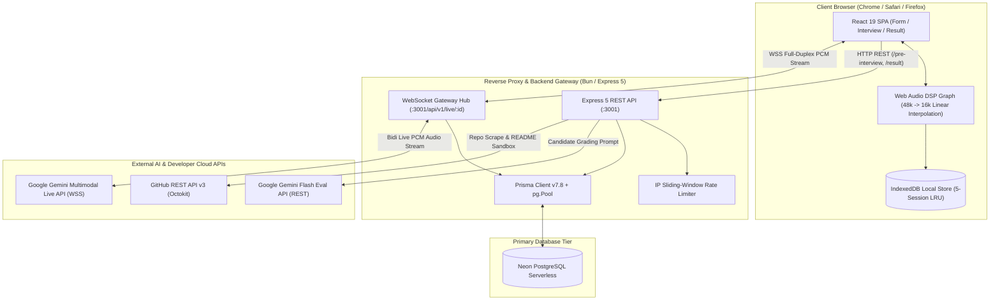

### Explanation of Components:
- **Client Tier**: A client-side Single Page Application handling UI rendering, native C++ Web Audio DSP streaming, barge-in interruptions, and zero-cost local audio caching in IndexedDB.
- **Backend Gateway**: A unified Bun + Express 5 application serving REST endpoints and managing stateful WebSocket connections that proxy real-time PCM audio to Google's Gemini Live API.
- **Data Tier**: PostgreSQL connected via Prisma ORM with `@prisma/adapter-pg` and connection pooling (`pg.Pool`), enforcing relational integrity between interviews and speech turns.
- **External AI Clouds**: Real-time voice generation is handled by Google's `gemini-3.1-flash-live-preview` (multimodal audio-in/audio-out), while post-interview evaluation is executed by `gemini-flash-latest` with structured JSON schema output.

### 💡 Interview Questions & Answers:
- **Q: Why use a backend WebSocket proxy instead of connecting the browser directly to Gemini Live?**
  - **A**: *(1) Security & Secret Isolation*: The server protects our primary Google AI credentials and rate limits abusive traffic. *(2) Session & Transcript Persistence*: The backend intercepts speech turns and writes them to PostgreSQL without trusting client inputs. *(3) BYOK Dynamic Routing*: The backend inspects incoming headers to seamlessly switch between hosted pool credentials and candidate-provided keys.

---

## 1.2 Client-Server-Cloud Protocol & Network Map

```mermaid
sequenceDiagram
    autonumber
    participant C as Client (Browser)
    participant B as Backend Gateway
    participant DB as PostgreSQL (Prisma)
    participant GL as Google Gemini Live (WSS)
    participant GF as Google Gemini Flash (REST)

    Note over C,B: Phase 1: Setup & Context Ingestion
    C->>B: POST /api/v1/pre-interview (JSON over HTTPS)
    B->>DB: INSERT INTO "Interview" (status='CREATED')
    B-->>C: 201 Created { id: "int_123" }

    Note over C,GL: Phase 2: Real-Time Multimodal Voice Session
    C->>B: WSS Handshake /api/v1/live/int_123
    B->>DB: UPDATE "Interview" SET status='IN_PROGRESS'
    B->>GL: WSS Connect + Send BidiGenerateContentSetup
    GL-->>B: setupComplete { sessionId: "gem_abc" }
    GL-->>B: Audio Out (24kHz PCM chunks)
    B-->>C: WS Audio { type: "audio", pcm: "base64..." }
    
    rect rgb(20, 30, 45)
        Note over C,GL: Conversational Loop (Sub-350ms Turnaround)
        C->>B: WS Audio { type: "audio", pcm: "16kHz base64" }
        B->>GL: realtimeInput.mediaChunks[pcm16k]
        GL-->>B: serverContent.modelTurn[pcm24k + transcript]
        B-->>C: WS Audio { type: "audio", pcm: "24kHz base64" }
        B->>DB: Async Serial Write (Message turns)
    end

    Note over C,GF: Phase 3: Post-Interview Structured Evaluation
    C->>B: GET /api/v1/result/int_123
    B->>GF: POST /v1beta/models/gemini-flash:generateContent (Structured JSON)
    GF-->>B: Scorecard JSON (overall, pillars, quotes)
    B->>DB: UPDATE "Interview" SET status='COMPLETED', evaluationData=...
    B-->>C: 200 OK { interview, scorecard }
```

### Explanation of Protocol Exchange:
1. **HTTPS REST**: Initial metadata setup and final evaluation report retrieval.
2. **WSS Client-to-Backend**: Full-duplex WebSocket sending client PCM chunks (16kHz mono Int16, 2048-sample frames) and receiving assistant audio (24kHz mono Int16).
3. **WSS Backend-to-Google**: Google's proprietary Bidi streaming protocol transmitting raw byte chunks wrapped in `realtimeInput` JSON messages.
4. **PostgreSQL Wire Protocol**: Non-blocking asynchronous query pipeline through `pg.Pool`.

---

## 1.3 End-to-End User Journey Macro State Machine

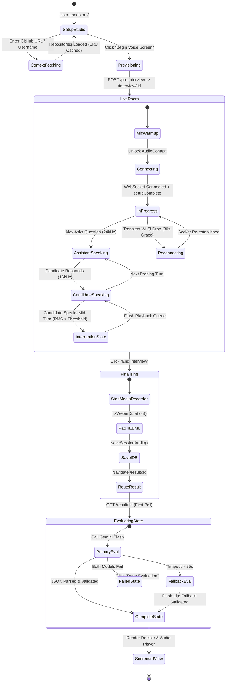

---

## 1.4 Production Deployment & Reverse Proxy Architecture

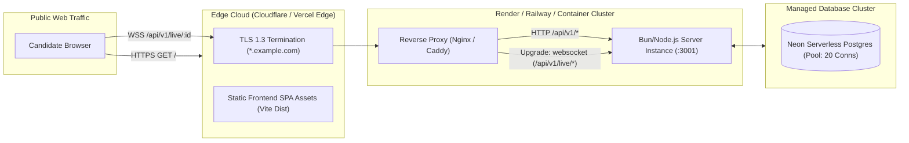

---

# Chapter 2: Frontend Component Architecture, State & React Tree

## 2.1 React Component Tree & DOM Hierarchy

```mermaid
graph TD
    App["App.tsx (Root Application Router)"]
    EB["ErrorBoundary (Catches Uncaught Rendering Errors)"]
    Router["BrowserRouter (React Router v7)"]
    
    App --> EB
    EB --> Router

    Router --> RouteHome["Route: / (Form.tsx)"]
    Router --> RouteInterview["Route: /interview/:id (Interview.tsx)"]
    Router --> RouteResult["Route: /result/:id (Result.tsx)"]
    
    subgraph FormSubtree ["Setup Studio (Form.tsx)"]
        RouteHome --> TrackGrid["Track Selector Grid (8 Domain Cards + Full Mock Hero)"]
        RouteHome --> SeniorityPills["Seniority Radios (Junior / Mid / Senior)"]
        RouteHome --> RepoPicker["Repository Search & Selector List"]
        RouteHome --> ApiModal["ApiKeyModal.tsx (BYOK Modal Dialog)"]
        RouteHome --> FormButtons["Action Buttons (Form Submit / Key Config)"]
    end

    subgraph InterviewSubtree ["Live Voice Room (Interview.tsx)"]
        RouteInterview --> VisualizerArea["Voice Visualizer Stage"]
        VisualizerArea --> OrbAssistant["VoiceOrb.tsx (Alex Audio RMS Level)"]
        VisualizerArea --> OrbUser["VoiceOrb.tsx (Candidate Mic RMS Level)"]
        RouteInterview --> TranscriptPills["Live Turn Status & Live Caption Subtitles"]
        RouteInterview --> ControlBar["Interview Controls (Mute / Device Picker / End Call)"]
    end

    subgraph ResultSubtree ["Executive Scorecard Dossier (Result.tsx)"]
        RouteResult --> HeaderActions["Header (Copy Share Link / Print PDF / BYOK Badge)"]
        RouteResult --> ScorecardHero["Executive Summary & Overall Recommendation Badge"]
        RouteResult --> AudioConsole["Audio Review Console (Waveform Scrubber / Speed Controls / Download)"]
        RouteResult --> PillarGrid["4-Pillar Competency Grid (Technical / Architecture / Story / Leadership)"]
        RouteResult --> EvidenceCard["Verbatim Transcript Evidence Quotes Card"]
        RouteResult --> TranscriptViewer["Interactive Transcript Search & Turn Explorer"]
    end
```

---

## 2.2 Frontend State & Hardware Hook Lifecycle

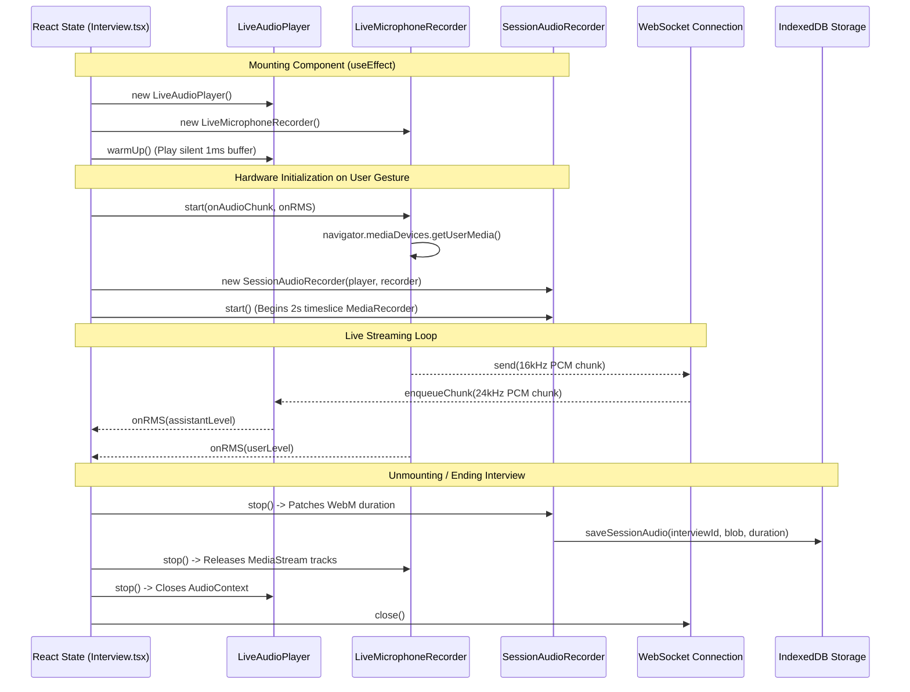

---

## 2.3 AudioContext Unlock, Gesture Warm-Up & onstatechange Auto-Resume

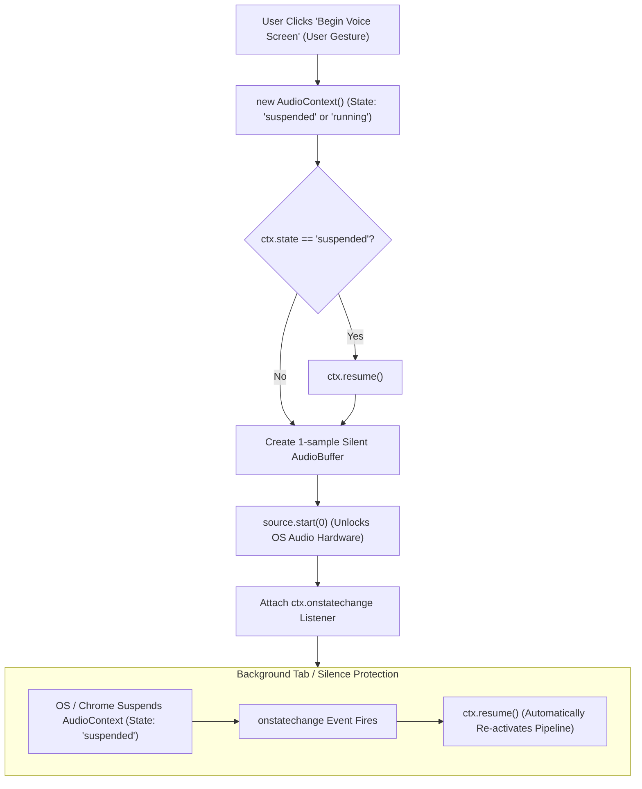

---

## 2.4 60 FPS VoiceOrb RMS Energy Visualizer Pipeline

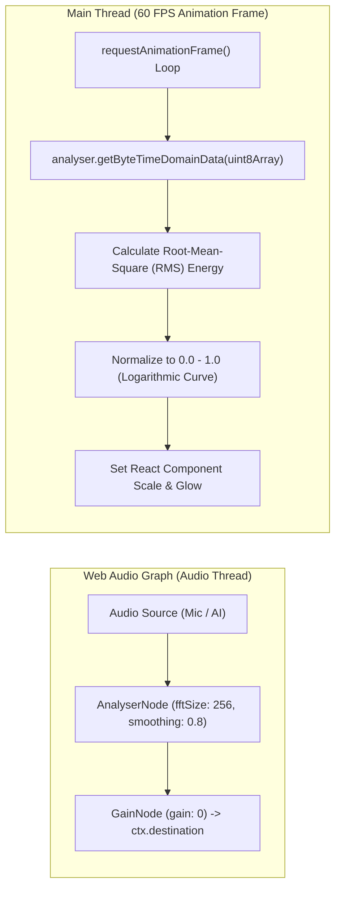

---

## 2.5 Executive Scorecard & Audio Review Console Anatomy

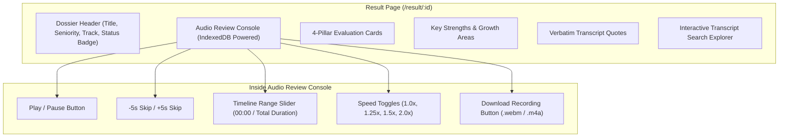

---

# Chapter 3: Backend Services, WebSocket Hub & Concurrency

## 3.1 Backend Layered Architecture & Modular Pipeline

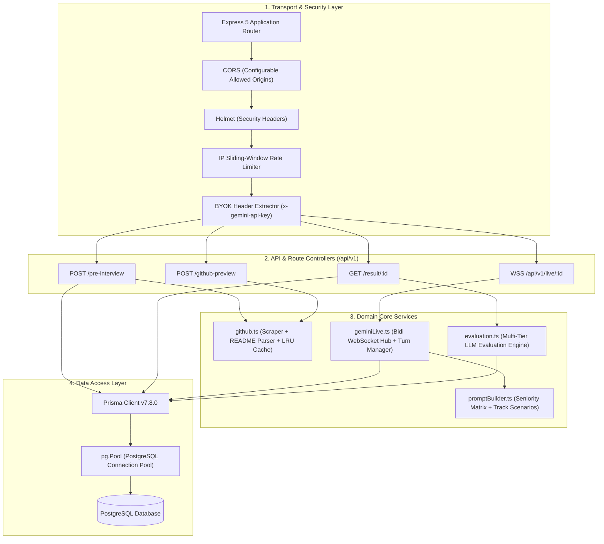

---

## 3.2 Full-Duplex WebSocket Gateway Hub (`geminiLive.ts`)

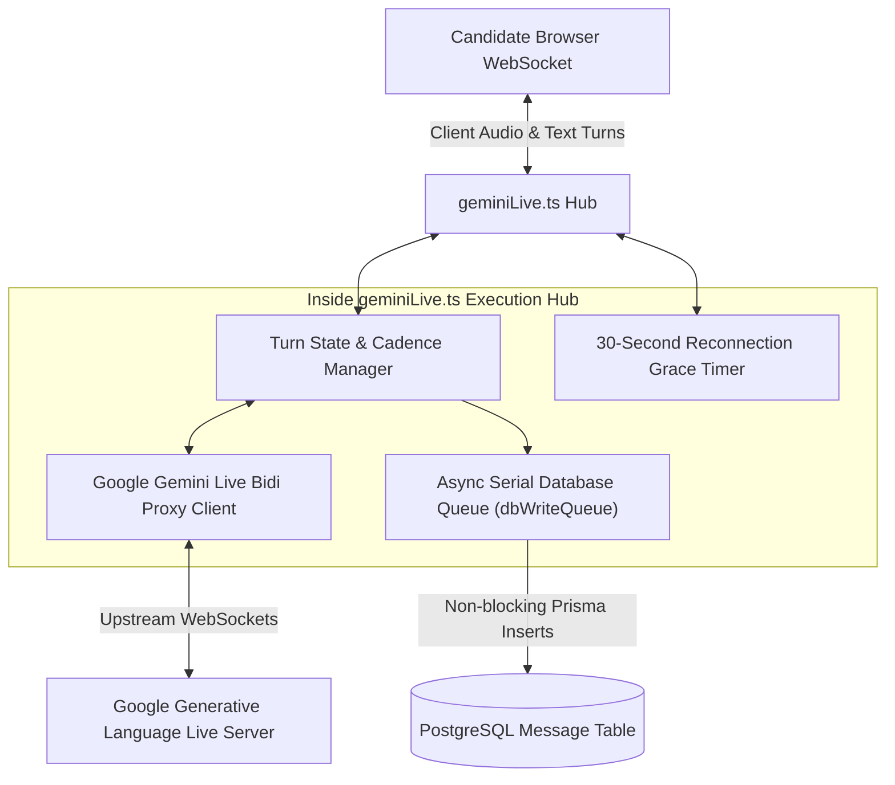

---

## 3.3 Upstream Gemini Live Handshake (`BidiGenerateContentSetup`)

```mermaid
sequenceDiagram
    participant B as Backend Gateway (geminiLive.ts)
    participant G as Google Gemini Live Server

    B->>G: WSS Connect to /ws/google.ai.generativelanguage.v1alpha.GenerativeService.BidiGenerateContent
    
    Note over B,G: Step 1: Client Setup Payload
    B->>G: Send JSON: { setup: { model: "models/gemini-3.1-flash-live-preview", generationConfig: { responseModalities: ["AUDIO"], speechConfig: { voiceConfig: { prebuiltVoiceConfig: { voiceName: "Aoede" } } } }, systemInstruction: { parts: [{ text: "Compiled Prompt..." }] } } }
    
    Note over B,G: Step 2: Server Confirmation
    G-->>B: Receive JSON: { setupComplete: {} }
    
    Note over B,G: Step 3: Bi-Directional Streaming Active
    B->>G: Send JSON: { realtimeInput: { mediaChunks: [{ mimeType: "audio/pcm;rate=16000", data: "base64..." }] } }
    G-->>B: Receive JSON: { serverContent: { modelTurn: { parts: [{ inlineData: { mimeType: "audio/pcm;rate=24000", data: "base64..." } }] } } }
```

---

## 3.4 Event Loop Concurrency & Micro-Task Scheduling

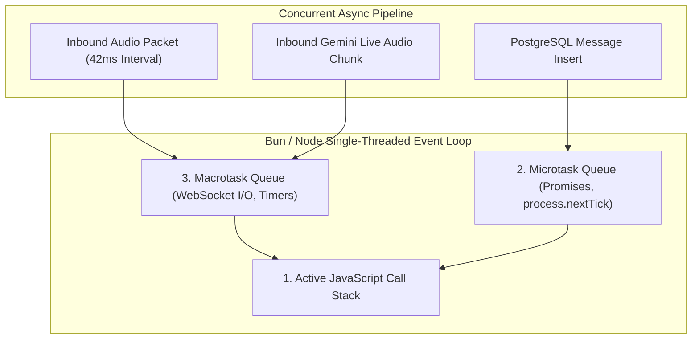

---

## 3.5 GitHub Context Ingestion & In-Memory LRU Cache

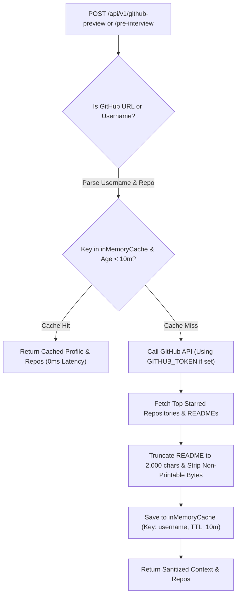

---

## 3.6 Multi-Model Evaluation Engine & 25s Timeout Fallback Race

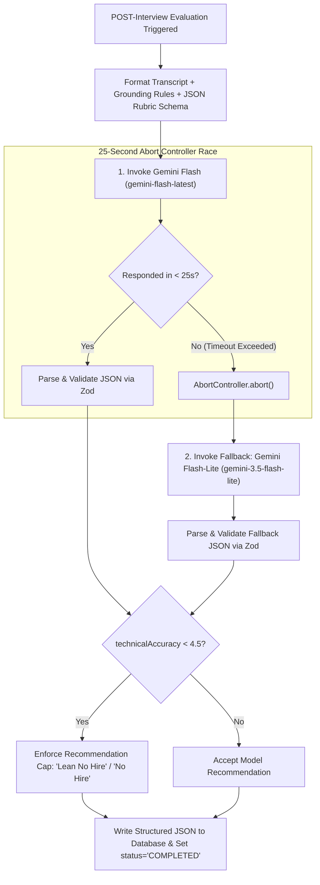

---

# Chapter 4: Step-by-Step User Actions & Button-Click Execution Flows

## 4.1 Action: GitHub Username / Repo URL Input (Typing & Blur)

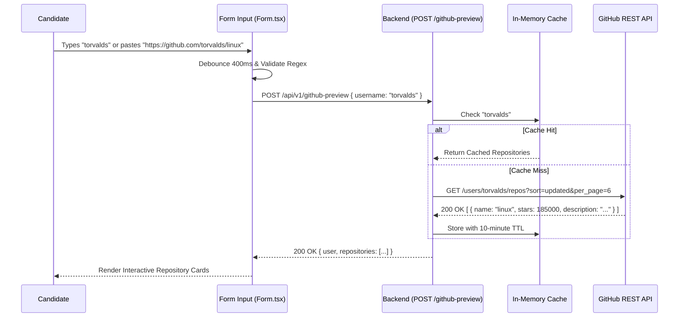

---

## 4.2 Action: Save Gemini API Key (BYOK Pre-Flight Validation)

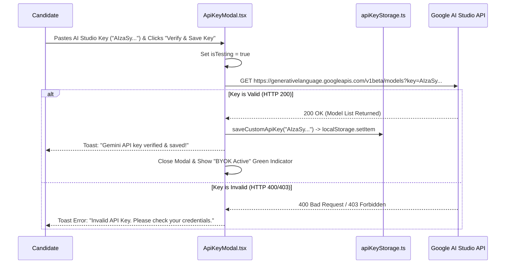

---

## 4.3 Action: "Begin Voice Screen" / "Start Interview"

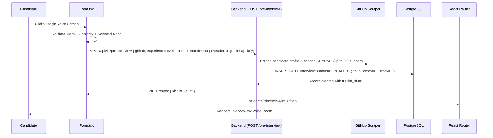

---

## 4.4 Action: "Join Live Interview" & Hardware Access

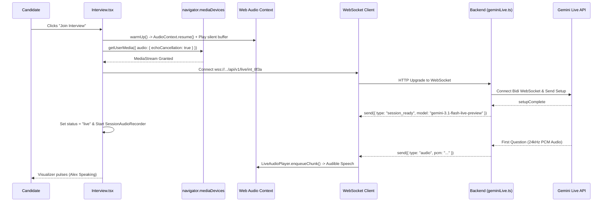

---

## 4.5 Action: "Mute / Unmute Microphone" (Timeline-Preserving Mute)

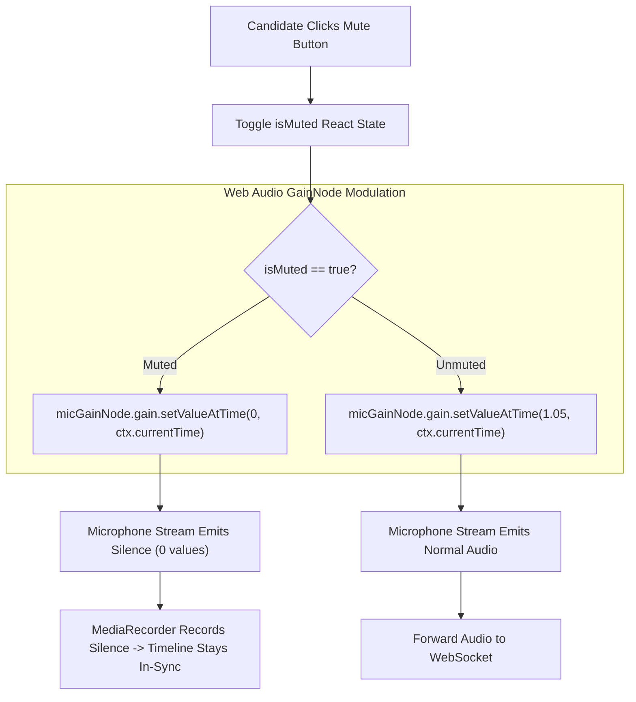

---

## 4.6 Action: Candidate Speaks & Client-Side Barge-In Interruption

```mermaid
sequenceDiagram
    participant Candidate as Candidate Voice
    participant Mic as LiveMicrophoneRecorder
    participant Player as LiveAudioPlayer
    participant WS as WebSocket Client
    participant Server as Backend Gateway
    participant Gemini as Gemini Live API

    Note over Player: Alex is Speaking (Playing 24kHz Audio Chunks)
    Candidate->>Mic: "Wait, let me explain the database indexing strategy..."
    Mic->>Mic: Calculate RMS Energy > Interruption Threshold (0.04)
    Mic->>Player: interrupt()
    Player->>Player: stop() and disconnect all active AudioBufferSourceNodes
    Player->>Player: Reset nextPlayTime = ctx.currentTime (Immediate Silence)
    
    Mic->>WS: send({ type: "interrupt" })
    WS->>Server: Forward Interruption Signal
    Server->>Gemini: Send realtimeInput (User Audio Chunks)
    Server->>Server: Truncate current Assistant turn with wasInterrupted = true
    Gemini->>Gemini: Abort model generation turn
    Note over Candidate,Gemini: Alex Stops Talking Instantly; Listens to Candidate
```

---

## 4.7 Action: "End Interview" & Local Audio Finalization

```mermaid
sequenceDiagram
    participant User as Candidate
    participant Room as Interview.tsx
    participant Recorder as SessionAudioRecorder
    participant Patcher as webmDurationPatcher.ts
    participant IDB as audioStorage.ts
    participant WS as WebSocket Client
    participant Nav as React Router

    User->>Room: Clicks "End Interview"
    Room->>Room: Set status = "ending"
    Room->>Recorder: stop()
    Recorder->>Recorder: MediaRecorder.stop() -> Aggregate WebM/M4A Chunks
    Recorder-->>Room: Return raw audio Blob (e.g. 8.4MB)
    Room->>Patcher: fixWebmDuration(blob, durationMs)
    Patcher->>Patcher: Patch EBML 0x4489 Duration Tag In-Place
    Patcher-->>Room: Return seekable WebM Blob
    Room->>IDB: saveSessionAudio(interviewId, patchedBlob, durationSeconds)
    IDB->>IDB: Write to IndexedDB + Evict sessions older than 5 or 7 days
    Room->>WS: close(1000, "Interview ended by user")
    Room->>Nav: navigate("/result/int_8f3a")
    Nav-->>User: Loads Result.tsx Scorecard Page
```

---

## 4.8 Action: "Retry Evaluation" (Error State Recovery)

```mermaid
sequenceDiagram
    participant User as Candidate
    participant ResultPage as Result.tsx
    participant API as Backend (GET /api/v1/result/:id)
    participant Eval as evaluation.ts
    participant DB as PostgreSQL

    User->>ResultPage: Clicks "Retry Evaluation"
    ResultPage->>API: GET /api/v1/result/int_8f3a?force=true
    API->>DB: UPDATE "Interview" SET status='EVALUATING'
    API->>Eval: evaluateInterview(interviewId, { force: true })
    Eval->>Eval: Re-invoke Gemini Flash / Flash-Lite Pipeline
    Eval->>DB: Save Scorecard JSON & Set status='COMPLETED'
    API-->>ResultPage: 200 OK { interview, scorecard }
    ResultPage-->>User: Renders Executive Dossier
```

---

## 4.9 Action: "Download Audio Recording" (IndexedDB Blob Export)

```mermaid
sequenceDiagram
    participant User as Candidate
    participant ResultPage as Result.tsx
    participant IDB as audioStorage.ts
    participant DOM as Browser DOM Engine

    User->>ResultPage: Clicks "Download Recording"
    ResultPage->>IDB: getSessionAudio(interviewId)
    IDB-->>ResultPage: Return { blob, extension: "webm", mimeType: "audio/webm" }
    ResultPage->>DOM: const url = URL.createObjectURL(blob)
    ResultPage->>DOM: const a = document.createElement("a")
    ResultPage->>DOM: a.href = url; a.download = "ai-interview-full-mock-screen-8f3a.webm"
    ResultPage->>DOM: document.body.appendChild(a); a.click(); a.remove()
    ResultPage->>DOM: URL.revokeObjectURL(url)
    DOM-->>User: Browser Save Dialog Opens & File Downloads to Disk
```

---

## 4.10 Action: "Share Scorecard / Print PDF"

```mermaid
flowchart TD
    UserAction["User Clicks 'Share' or 'Print PDF'"] --> ActionType{"Selected Action"}
    
    ActionType -->|"Share Scorecard"| CopyLink["navigator.clipboard.writeText(window.location.href)"]
    CopyLink --> ToastSuccess["Toast: 'Scorecard link copied to clipboard!'"]
    
    ActionType -->|"Print PDF"| TriggerPrint["window.print()"]
    TriggerPrint --> MediaPrint["CSS @media print Stylesheet Triggered"]
    MediaPrint --> LayoutAdjust["Hide Navbar, Audio Controls, Search Bars; Expand Full Transcript"]
    LayoutAdjust --> PDFSave["Browser Native PDF Export / Print Dialog Opens"]
```

---

# Chapter 5: Low-Level Audio DSP Engineering, Graph Routing & Codecs

## 5.1 Dual-Track Web Audio DSP Graph Topology

```mermaid
graph TD
    subgraph HardwareInputs ["Hardware Inputs & Playback Sources"]
        MicRaw["Candidate Mic (getUserMedia)"]
        AIPCMSource["AI AudioBufferSourceNodes (24kHz Decoded Audio)"]
    end

    subgraph NativeDSPGraph ["Browser Native C++ Web Audio DSP Thread"]
        MicSourceNode["MediaStreamAudioSourceNode"]
        MicGain["Mic GainNode (gain: 1.05 + Mute Control)"]
        
        AIGainMaster["LiveAudioPlayer.masterGainNode (gain: 1.0)"]
        AIGainRec["AI Recording GainNode (gain: 0.95 Headroom)"]
        
        HardwareOut["ctx.destination (Speaker / Earphones)"]
        MixerNode["MediaStreamAudioDestinationNode (Dual-Track Mixer)"]
        
        MicRaw --> MicSourceNode --> MicGain
        AIPCMSource --> AIGainMaster
        AIGainMaster --> HardwareOut
        AIGainMaster --> AIGainRec
        
        MicGain --> MixerNode
        AIGainRec --> MixerNode
    end

    subgraph NativeRecording ["Local Recording Pipeline"]
        MixerNode --> MediaRec["MediaRecorder (Timeslice: 2000ms)"]
        MediaRec --> Blobs["Recorded Audio Chunks Array"]
    end
```

---

## 5.2 48kHz to 16kHz Linear Interpolation Resampling & PCM Quantization

```mermaid
flowchart TD
    InputSample["Input Sample Buffer: 48,000 Hz Float32 [-1.0, 1.0]"] --> Resample["Linear Interpolation Resampling: ratio = 48000 / 16000 = 3.0"]
    
    subgraph ResampleMath ["Linear Interpolation Algorithm"]
        Resample --> CalcIndex["originalIndex = i * ratio"]
        CalcIndex --> CalcNeighbors["indexFloor = floor(originalIndex), indexCeil = min(length-1, indexFloor+1)"]
        CalcNeighbors --> Interp["result[i] = buf[floor] * (1 - frac) + buf[ceil] * frac"]
    end

    Interp --> Clamp["Clamp Float to [-1.0, 1.0]"]
    
    subgraph QuantizeMath ["16-Bit Signed Integer Quantization"]
        Clamp --> Scale{"sample < 0?"}
        Scale -->|"Yes"| NegScale["int16 = sample * 0x8000 (-32768)"]
        Scale -->|"No"| PosScale["int16 = sample * 0x7FFF (+32767)"]
        NegScale --> LittleEndian["Pack Little-Endian: bytes[0] = int16 & 0xFF, bytes[1] = (int16 >> 8) & 0xFF"]
        PosScale --> LittleEndian
    end

    LittleEndian --> Base64["Convert Uint8Array to Base64 String"]
```

---

## 5.3 Call Stack Overflow Protection in PCM Chunk Serialization

```mermaid
flowchart LR
    Uint8Bytes["Large Uint8Array (e.g. 65,536 Bytes)"] --> NaiveApproach["Naive: String.fromCharCode.apply(null, bytes)"]
    NaiveApproach --> StackError["❌ RangeError: Maximum call stack size exceeded (>65,536 arguments)"]
    
    Uint8Bytes --> ChunkedApproach["Chunked Slice Approach (CHUNK_SIZE = 0x8000 / 32,768)"]
    ChunkedApproach --> LoopChunks["Iterate 32KB Subarrays"]
    LoopChunks --> ChunkString["binary += String.fromCharCode.apply(null, subarray)"]
    ChunkString --> SafeBase64["Safe: globalThis.btoa(binary)"]
    SafeBase64 --> Success["✅ 100% Memory & Stack Safe Base64 Output"]
```

---

## 5.4 Jitter-Free 24kHz AudioBuffer Scheduling Pipeline

```mermaid
sequenceDiagram
    participant WS as WebSocket (Inbound Audio)
    participant Player as LiveAudioPlayer
    participant Ctx as AudioContext (ctx.currentTime)
    participant Speaker as Hardware Output

    WS->>Player: Chunk 1 (Duration: 120ms) arrives at t = 1.000s
    Player->>Ctx: Check nextPlayTime (Initial: 0s -> set to ctx.currentTime = 1.000s)
    Player->>Speaker: source1.start(1.000s)
    Player->>Player: Update nextPlayTime = 1.000s + 0.120s = 1.120s

    WS->>Player: Chunk 2 (Duration: 80ms) arrives at t = 1.040s (Early)
    Player->>Speaker: source2.start(1.120s) (Queued precisely after Chunk 1)
    Player->>Player: Update nextPlayTime = 1.120s + 0.080s = 1.200s

    WS->>Player: Chunk 3 (Duration: 100ms) arrives at t = 1.110s (Early)
    Player->>Speaker: source3.start(1.200s) (Queued seamlessly)
    Player->>Player: Update nextPlayTime = 1.200s + 0.100s = 1.300s
    Note over Speaker: Zero gaps, clicks, pops, or audio jitter!
```

---

## 5.5 Cross-Browser MediaRecorder Codec Negotiation Matrix

```mermaid
flowchart TD
    InitRecorder["SessionAudioRecorder.getOptimalMimeType()"] --> CheckWebmOpus{"MediaRecorder.isTypeSupported('audio/webm;codecs=opus')?"}
    
    CheckWebmOpus -->|"Supported (Chrome / Firefox / Edge)"| UseWebm["MIME: 'audio/webm;codecs=opus' | Ext: 'webm' | Needs EBML Patch: TRUE"]
    CheckWebmOpus -->|"Not Supported (Safari / iOS)"| CheckMp4{"MediaRecorder.isTypeSupported('audio/mp4')?"}
    
    CheckMp4 -->|"Supported (Safari macOS / iOS)"| UseMp4["MIME: 'audio/mp4' | Ext: 'm4a' | Native QuickTime Support"]
    CheckMp4 -->|"Not Supported"| CheckAac{"MediaRecorder.isTypeSupported('audio/aac')?"}
    
    CheckAac -->|"Supported"| UseAac["MIME: 'audio/aac' | Ext: 'm4a'"]
    CheckAac -->|"Fallback"| UseWav["MIME: 'audio/wav' | Ext: 'wav'"]
```

---

## 5.6 Chromium EBML Duration Header Byte-Level Patcher

```mermaid
flowchart TD
    RawBlob["Raw WebM Audio Blob (Duration = Infinity)"] --> ToArrayBuf["blob.arrayBuffer()"]
    ToArrayBuf --> ScanHeader["Scan DataView for EBML Segment Info Element (0x1549A966)"]
    ScanHeader --> ScanDurationTag["Scan Info Sub-elements for Duration Tag (0x4489)"]
    
    ScanDurationTag --> CheckLength{"Duration Tag Length?"}
    CheckLength -->|"4 Bytes (Float32)"| WriteFloat32["view.setFloat32(offset, durationMs, false /* Big Endian */)"]
    CheckLength -->|"8 Bytes (Float64)"| WriteFloat64["view.setFloat64(offset, durationMs, false /* Big Endian */)"]
    
    WriteFloat32 --> PatchedBlob["new Blob([arrayBuffer], { type: 'audio/webm' })"]
    WriteFloat64 --> PatchedBlob
    PatchedBlob --> SeekableResult["✅ Fully Seekable & Scrub-bar Enabled WebM Audio"]
```

---

# Chapter 6: AI Prompting, Turn Cadence & Evaluation Rubric Pipelines

## 6.1 Dynamic Multi-Track Depth Generator & Seniority Decision Tree

```mermaid
graph TD
    TrackSelection["Selected Track (e.g. Backend / Full Mock)"] --> SeniorityCheck{"Seniority Level"}
    
    subgraph JuniorTier ["Junior / Entry Level (0-2 Years)"]
        JuniorCheck["Focus: Core Syntax, Data Structures, Basic CRUD, Optimistic UI"]
        JuniorDepth["Probing Depth: 1-2 Layers (How does state update? What happens on error?)"]
    end

    subgraph MidTier ["Mid-Level Engineer (2-5 Years)"]
        MidCheck["Focus: Database Schema, Indexing (B-Tree/GIN), Race Conditions, Idempotency"]
        MidDepth["Probing Depth: 2-3 Layers (Lock contention, cache invalidation, API contracts)"]
    end

    subgraph SeniorTier ["Senior / Staff Engineer (5+ Years)"]
        SeniorCheck["Focus: Distributed Consensus, LSM Trees vs B-Trees, Zero-Downtime Migration, Split-Brain"]
        SeniorDepth["Probing Depth: 3-4 Layers (Network partitions, write amplification, blast radius)"]
    end

    SeniorityCheck -->|"JUNIOR"| JuniorTier
    SeniorityCheck -->|"MID"| MidTier
    SeniorityCheck -->|"SENIOR"| SeniorTier
```

---

## 6.2 2-Sentence Turn Cadence & Airtime Governance Formula

```mermaid
flowchart TD
    CandidateTurn["Candidate Completes Speech Turn"] --> Sentence1["Sentence 1: Micro-Grounding (≤ 8 Words)<br/>'Makes sense regarding the Redis failover.'"]
    Sentence1 --> Sentence2["Sentence 2: Probing Question<br/>'How do you prevent split-brain during leader election under network partitions?'"]
    Sentence2 --> TotalOutput["AI Speaks ≤ 2 Sentences (Airtime < 20% of Session)"]
    TotalOutput --> CandidateFloor["Candidate Holds > 80% Floor Airtime"]
```

---

## 6.3 Voice Boundary Filtering (Thinking Silence & Backchanneling)

```mermaid
flowchart TD
    VoiceInput["Candidate Audio Transcribed"] --> PatternCheck{"Match Candidate Intent"}
    
    PatternCheck -->|"Thinking Indicator ('Hmm, let me think...', 'Give me a sec')"| ThinkingSilence["Respond: 'Take your time.' -> Enter Listening State"]
    PatternCheck -->|"Passive Backchannel ('Yeah', 'Right', 'Uh-huh')"| SuppressResponse["Suppress AI Speech Turn -> Maintain Floor for Candidate"]
    PatternCheck -->|"Phonetic Speech Anomaly ('post grass', 'k eight s', 'read us')"| PhoneticNormalize["Normalize: PostgreSQL, Kubernetes (K8s), Redis"]
    PatternCheck -->|"Concrete Technical Response"| StandardProbing["Execute 2-Sentence Turn Formula"]
```

---

## 6.4 Sandboxed XML Prompt Injection Defense

```mermaid
flowchart LR
    RawInput["Untrusted GitHub README or Candidate Input"] --> StripControl["Strip Non-Printable ASCII & Control Characters"]
    StripControl --> Truncate["Truncate to 2,000 Characters"]
    Truncate --> EncloseXML["Enclose in Strict XML Delimiters:<br/>&lt;candidate_project_readme&gt;...&lt;/candidate_project_readme&gt;"]
    EncloseXML --> SystemInstruction["Inject into Gemini Live System Prompt with Non-Executive Directives"]
    SystemInstruction --> Defense["✅ Immune to 'Ignore previous instructions' & System Overrides"]
```

---

## 6.5 Objective 4-Pillar Scoring Rubric & Anti-Sycophancy Gate

```mermaid
flowchart TD
    subgraph RubricEvaluation ["4-Pillar Evidence-Grounded Scoring (0-10)"]
        Pillar1["1. Technical Systems & Mechanics (/10)"]
        Pillar2["2. Architectural Judgment & Trade-offs (/10)"]
        Pillar3["3. Storytelling & Articulation (/10)"]
        Pillar4["4. Production & Leadership (/10)"]
    end

    RubricEvaluation --> CalcAccuracy{"Is Technical Accuracy < 4.5?"}
    
    CalcAccuracy -->|"Yes (Severe Technical Gaps)"| HardCap["ENFORCE ANTI-SYCOPHANCY GATE:<br/>Cap Recommendation at 'Lean No Hire' or 'No Hire'<br/>(Communication polish cannot override technical failure)"]
    CalcAccuracy -->|"No (Technical Competence Met)"| StandardScore["Compute Composite Score & Calibrate: Strong Hire / Hire / Lean Hire"]
```

---

# Chapter 7: Database Schemas, Storage Engines & Fault Recovery

## 7.1 PostgreSQL Relational Entity-Relationship (ER) Schema

```mermaid
erDiagram
    Interview ||--o{ Message : "contains (1 to many)"
    
    Interview {
        String id PK "UUID"
        String github "GitHub Username or URL"
        Json githubContext "Parsed Repo READMEs & Metadata"
        ExperienceLevel experienceLevel "JUNIOR | MID | SENIOR"
        InterviewTrack track "FULL_MOCK_SCREEN | BACKEND | etc."
        InterviewStatus status "CREATED | IN_PROGRESS | EVALUATING | COMPLETED | FAILED"
        Int score "0-100 Composite Score"
        String feedback "Executive Summary Markdown"
        Json evaluationData "Full Structured Scorecard JSON"
        DateTime createdAt "Indexed Timestamp"
    }

    Message {
        String id PK "UUID"
        String interviewId FK "Cascade on Delete"
        String message "Turn Transcription Text"
        MessageType type "User | Assistant"
        Int turnIndex "Sequential Turn Sequence Number"
        Boolean wasInterrupted "Flag if Candidate Cut Off Assistant"
        DateTime createdAt "Timestamp"
    }
```

---

## 7.2 Asynchronous Non-Blocking Serial Database Write Queue

```mermaid
sequenceDiagram
    participant WS as WebSocket Hub (geminiLive.ts)
    participant Queue as dbWriteQueue (Promise Chain)
    participant Prisma as Prisma Client
    participant DB as PostgreSQL

    WS->>Queue: persistTurn(User, "I used Kafka", false) -> Turn #1
    Queue->>Prisma: prisma.message.create({ turnIndex: 1 })
    
    WS->>Queue: persistTurn(Assistant, "Why Kafka?", true) -> Turn #2
    Note over Queue: Turn #2 waits for Turn #1 Promise to settle
    
    Prisma->>DB: INSERT Message Turn #1
    DB-->>Prisma: Turn #1 Committed
    Queue->>Prisma: prisma.message.create({ turnIndex: 2 })
    Prisma->>DB: INSERT Message Turn #2
    DB-->>Prisma: Turn #2 Committed
    Note over WS: WebSocket forwards audio with 0ms database blocking!
```

---

## 7.3 Client-Side IndexedDB Storage & LRU 5-Session Auto-Eviction

```mermaid
flowchart TD
    SaveCall["saveSessionAudio(interviewId, blob, duration)"] --> OpenDB["openAudioDatabase('ai_interviewer_audio_db')"]
    OpenDB --> StoreObject["objectStore('recordings').put(record)"]
    
    StoreObject --> ScanKeys["Scan all records in 'recordings'"]
    ScanKeys --> SortTimestamps["Sort records by timestamp ascending (Oldest First)"]
    
    SortTimestamps --> CheckLimits{"Total Records > 5 OR Age > 7 Days?"}
    
    CheckLimits -->|"Yes"| DeleteOldest["objectStore('recordings').delete(oldestKey)"]
    CheckLimits -->|"No"| Complete["Storage Transaction Committed (< 50MB Disk Cap)"]
    DeleteOldest --> Complete
```

---

## 7.4 Network Disconnection & 30-Second Graceful Reconnection Flow

```mermaid
sequenceDiagram
    participant Browser as Candidate Browser
    participant Gateway as Backend Gateway
    participant Session as Active Gemini Live Session
    participant DB as PostgreSQL

    Note over Browser,Gateway: Wi-Fi Glitch / Connection Drop (TCP Socket Closes)
    Browser->>Browser: WebSocket.onclose -> Trigger Reconnect Loop
    Gateway->>Gateway: Start 30-Second Grace Timer (Hold Gemini Session in RAM)
    
    Browser->>Gateway: Reconnect WebSocket /api/v1/live/int_8f3a (Attempt 1: 1.5s)
    Gateway->>Gateway: Cancel Grace Timer (Session Re-attached)
    Gateway->>DB: Fetch past turns for int_8f3a
    Gateway-->>Browser: send({ type: "session_reconnected", turns: [...] })
    Note over Browser,Session: Audio streaming resumes seamlessly without resetting interview state!
```

---

# 🎓 Quick Interview Cheat Sheet

| Topic | Key Metric / Architectural Principle |
| :--- | :--- |
| **P95 Latency** | $\le 350\text{ms}$ turnaround via native Bidi audio streaming (no cascaded STT $\rightarrow$ LLM $\rightarrow$ TTS). |
| **Audio Capture** | 16kHz Mono Int16 Little-Endian PCM via linear interpolation from 48kHz hardware. |
| **Playback** | Gapless 24kHz AudioBuffer scheduling with cursor `nextPlayTime`. |
| **Barge-In** | Client-side RMS detection ($>0.04$) instantly drains active source nodes and notifies backend. |
| **Recording** | Zero server cost; dual-track mixed in Web Audio DSP graph, cached in IndexedDB with 5-session LRU cap. |
| **WebM Bug** | In-place EBML duration patching (`0x4489`) fixes Chromium's `Infinity` duration bug. |
| **Anti-Sycophancy** | Hard gate at `technicalAccuracy < 4.5` enforces `No Hire` regardless of candidate communication polish. |
| **Concurrency** | Single-threaded non-blocking event loop using `dbWriteQueue` micro-task serialization. |
| **BYOK Security** | Zero-persistence model; candidate keys stored solely in client `localStorage` and passed via headers. |
