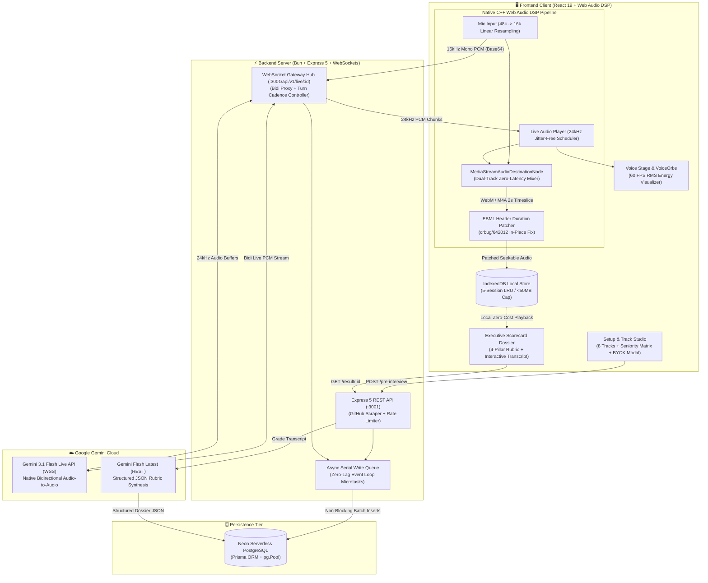

# AI Technical Interviewer — Internal Documentation Suite

Welcome to the internal engineering documentation for the **AI Technical Interviewer** platform. This repository powers real-time, low-latency, voice-driven technical interview screens calibrated to candidate seniority, tech stack, and GitHub portfolio context with instant Tier-1 evaluation dossiers.

---

## 📚 Table of Contents

| Document | Topic & Focus Area |
| :--- | :--- |
| [**01. System Architecture**](./01_SYSTEM_ARCHITECTURE.md) | High-level topology, monorepo layout, end-to-end data flows, and design principles. |
| [**02. Frontend Deep Dive**](./02_FRONTEND_DEEP_DIVE.md) | React components (`Form`, `Interview`, `Result`), Web Audio API pipeline, PCM streaming & playback. |
| [**03. Backend Deep Dive**](./03_BACKEND_DEEP_DIVE.md) | Express HTTP routes, WebSocket gateway, Gemini Live integration, and GitHub ingestion engine. |
| [**04. AI Prompting & Evaluation**](./04_AI_PROMPTING_AND_EVAL.md) | Staff Engineer Alex persona, 2-sentence conversational cadence, 3-layer depth drill, and Tier-1 rubrics. |
| [**05. Database & State Flow**](./05_DATABASE_AND_STATE_FLOW.md) | PostgreSQL schema, Prisma models, interview lifecycle state machine, and asynchronous turn persistence. |
| [**06. Deployment & BYOK Architecture**](./06_DEPLOYMENT_AND_BYOK.md) | Environment configuration, Vercel/Render hosting topologies, and Bring-Your-Own-Key security. |
| [**07. Troubleshooting & Runbook**](./07_TROUBLESHOOTING_RUNBOOK.md) | Diagnostic runbooks for common failures, local test scripts, and operational recovery commands. |
| [**08. API & WebSocket Reference**](./08_API_REFERENCE.md) | Complete reference for REST endpoints, schemas, real-time WebSocket protocol frames, and SDK integration examples. |
| [**09. Benchmarks & Evaluation Metrics**](./09_BENCHMARKS_AND_EVALUATIONS.md) | Latency budgets (P50/P95), Web Audio benchmarks, barge-in performance, and hiring evaluation calibration. |
| [**10. Architecture & Data Flow Diagrams**](./10_ARCHITECTURE_AND_DATA_FLOW_DIAGRAMS.md) | Master reference with 40 architectural diagrams, step-by-step traces, DSP math, and interview defense cheat sheet. |
| [**11. Interview Questions & Staff Defense**](./11_INTERVIEW_QUESTIONS_AND_STAFF_DEFENSE_COMPENDIUM.md) | Complete question bank (Fresher to Staff) covering React, Web Audio DSP, WebSockets, Prisma, AI Rubrics, and 100k-concurrency System Design. |

---

## ⚡ Quick Architecture Overview

